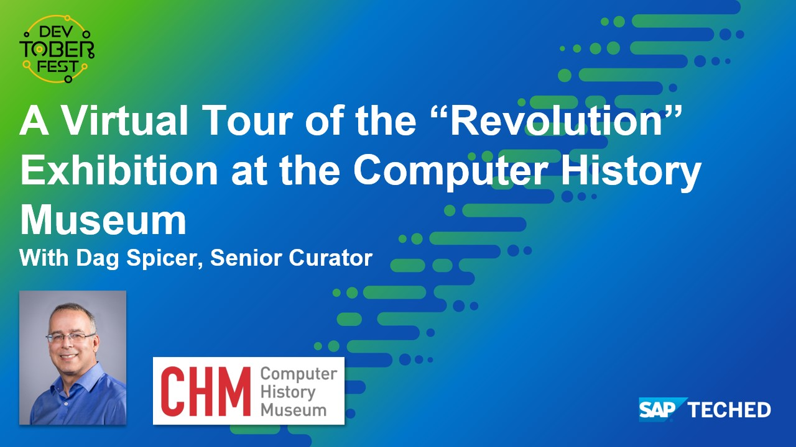

This tutorial is part of the Devtoberfest 2021, a celebration of and for Developers. For more information, see [Devtoberfest 2021 on GitHub](https://github.com/SAP-samples/devtoberfest-2021).

---

[ACCORDION-BEGIN [Step 1: ](Watch "A Virtual Tour of the “Revolution” Exhibition at the Computer History Museum")]

Watch "A Virtual Tour of the “Revolution” Exhibition at the Computer History Museum" live or recording.

[Join Us on YouTube](https://youtu.be/M6SXIeXbnik)

For more information see the [session's details](https://github.com/SAP-samples/devtoberfest-2021/tree/main/topics/Week1_Welcome#a-virtual-tour-of-the-revolution-exhibition-at-the-computer-history-museum-by-dag-spicer-senior-curator).

[VALIDATE_1]
[ACCORDION-END]
---

---
