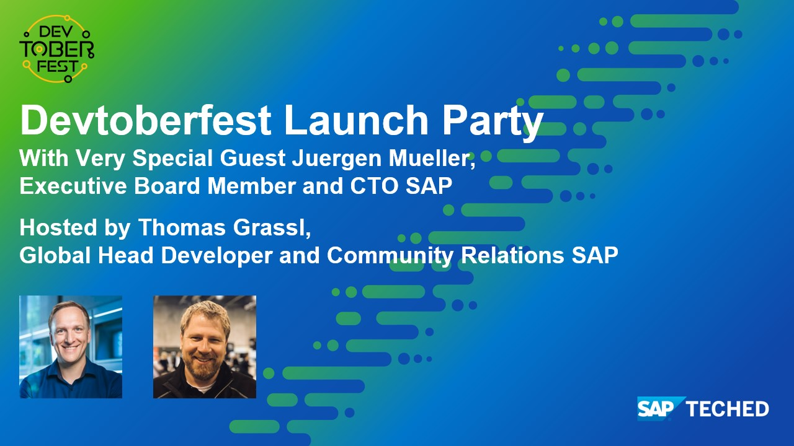

This tutorial is part of the Devtoberfest 2021, a celebration of and for Developers. For more information, see [Devtoberfest 2021 on GitHub](https://github.com/SAP-samples/devtoberfest-2021).

---

[ACCORDION-BEGIN [Step 1: ](Watch "Devtoberfest Launch Party")]

Watch "Devtoberfest Launch Party" live or recording.

[Join Us on YouTube](https://youtu.be/QECsPXQBP3E)

For more information see the [session's details](https://github.com/SAP-samples/devtoberfest-2021/tree/main/topics/Week1_Welcome#juergen-mueller-and-thomas-grassl-devtoberfest-launch-party).

[VALIDATE_1]
[ACCORDION-END]

---
