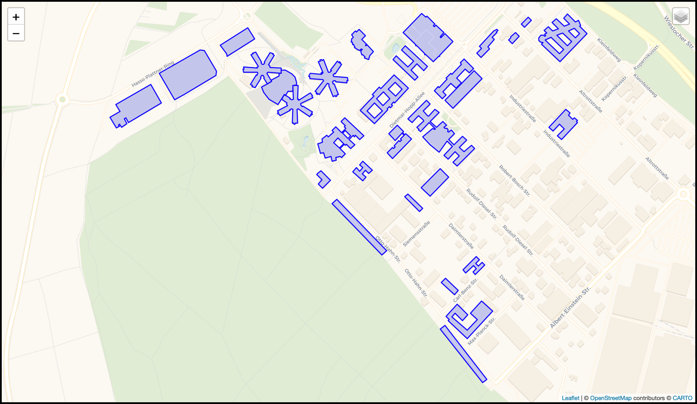
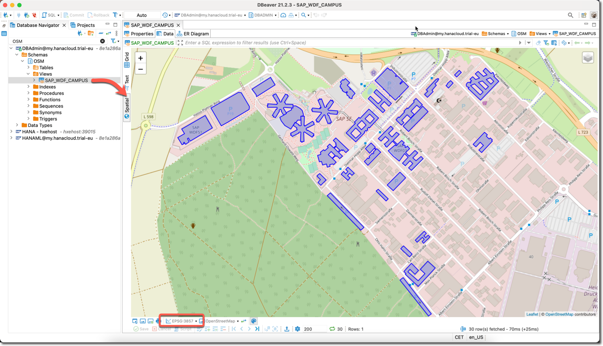

This web page is part of [Devtoberfest 2021](https://github.com/SAP-samples/devtoberfest-2021#readme), a celebration of and for Developers.

---

[ACCORDION-BEGIN [Step 1: ](Understand the challenge)]

In this challenge, you’ll work with data from OpenStreetMap® open data ([© OpenStreetMap contributors](https://www.openstreetmap.org/copyright)) representing buildings on the SAP campus in Walldorf, Germany.

This subset contains all buildings of the campus, incl. offices, parking garages, a restaurant, and even a kindergarten (German word for the "child care").



Your **challenge is to calculate**:

1. what are the two buildings, which centroids are the furthest from each other,
2. what is the distance in meters (on the Round Earth) between centroids of those two buildings from point 1.

> ### How to get help
> If you are stuck at any step of this challenge, or have problems submitting your answers, please [open an issue](https://github.com/SAP-samples/devtoberfest-2021/issues/new?assignees=Sygyzmundovych&labels=week5-data-analytics&template=about-week-5--data-analytics--content.md&title=).

The step 7 at the bottom of this tutorial will allow you to validate your results and get Devtoberfest points, if your answer is correct!

[DONE]
[ACCORDION-END]

[ACCORDION-BEGIN [Step 2: ](Pre-requisites)]

### SAP HANA database

You can use [SAP HANA Cloud, SAP HANA database](https://help.sap.com/viewer/product/HANA_CLOUD_DATABASE/latest/en-US) or [SAP HANA 2.0 SPS05](https://help.sap.com/viewer/product/SAP_HANA_PLATFORM/latest) with Spatial option.

Links to get access to free versions of the software, if you do not have access to it yet:

- [SAP HANA Cloud trial](https://developers.sap.com/tutorials/hana-trial-advanced-analytics.html),
- [SAP HANA, express edition](https://www.sap.com/products/hana/express-trial.html).

### SQL basics

Popularity of other programming languages is rising and falling, while Structured Query Language -- or SQL for short -- still ranks among the most-used languages in the programming industry.

In 2021 Stack Overflow Annual Developer Survey [over half of surveyed professional developers reported that they use it](https://insights.stackoverflow.com/survey/2021#most-popular-technologies-language-prof).

### Database client

You should be able to work with your database instance: have an authorized user and be able to run SQL statements.

Below is a list of typical clients (plus links to more information, if you need to familiarize yourself with the particular tool).

- [SAP HANA Client](https://developers.sap.com/tutorials/hana-clients-install.html),
- [SAP Database Explorer](https://developers.sap.com/group.hana-cloud-get-started.html),
- [DBeaver](https://blogs.sap.com/2020/01/08/good-things-come-together-dbeaver-sap-hana-spatial-beer/).

> ### Spatial data visualization
> DBeaver might be especially helpful, if you want to [work with geospatial data](https://github.com/dbeaver/dbeaver/wiki/Working-with-Spatial-GIS-data) stored in a database.

### Basic understanding of geospatial data

This challenge is quite a simple calculation task. But it requires basic understanding of geospatial data representation and processing.

We covered this topic in [the series of presentations during last year's Devtoberfest](https://www.youtube.com/playlist?list=PL6RpkC85SLQA8za7iX9FRzewU7Vs022dl).  

To quickly get the minimum required understanding of geospatial SQL in SAP HANA, you can go through these tutorials:

1. [Introduction to SAP HANA Spatial Data Types](https://developers.sap.com/group.hana-aa-spatial-get-started.html)
2. [Introduction to SAP HANA Spatial Methods](https://developers.sap.com/group.hana-aa-spatial-methods.html)

Should you want to learn more, then additional content is available in the last step of this document.

[DONE]
[ACCORDION-END]

[ACCORDION-BEGIN [Step 3: ](Create database objects)]

In this step, use provided SQL statements to create:

  - a database schema `OSM` (optional, if you have a required privilege and if you want to separate DB objects created in this exercise),
  - a table `PLANET_OSM_POLYGON` with OpenStreetMap data structure.

1. Create a schema (optional)

	```SQL
	--DROP SCHEMA "OSM" CASCADE;
	CREATE SCHEMA "OSM";
	SET SCHEMA "OSM";
	```

2. Create a table in OSM format

	```SQL
	--SET SCHEMA "OSM";

	-- DROP TABLE "PLANET_OSM_POLYGON";
	CREATE TABLE "PLANET_OSM_POLYGON"
	("osm_id" BIGINT,
	"access" NVARCHAR(5000),
	"addr:housename" NVARCHAR(5000),
	"addr:housenumber" NVARCHAR(5000),
	"addr:interpolation" NVARCHAR(5000),
	"admin_level" NVARCHAR(5000),
	"aerialway" NVARCHAR(5000),
	"aeroway" NVARCHAR(5000),
	"amenity" NVARCHAR(5000),
	"area" NVARCHAR(5000),
	"barrier" NVARCHAR(5000),
	"bicycle" NVARCHAR(5000),
	"brand" NVARCHAR(5000),
	"bridge" NVARCHAR(5000),
	"boundary" NVARCHAR(5000),
	"building" NVARCHAR(5000),
	"construction" NVARCHAR(5000),
	"covered" NVARCHAR(5000),
	"culvert" NVARCHAR(5000),
	"cutting" NVARCHAR(5000),
	"denomination" NVARCHAR(5000),
	"disused" NVARCHAR(5000),
	"embankment" NVARCHAR(5000),
	"foot" NVARCHAR(5000),
	"generator:source" NVARCHAR(5000),
	"harbour" NVARCHAR(5000),
	"highway" NVARCHAR(5000),
	"historic" NVARCHAR(5000),
	"horse" NVARCHAR(5000),
	"intermittent" NVARCHAR(5000),
	"junction" NVARCHAR(5000),
	"landuse" NVARCHAR(5000),
	"layer" NVARCHAR(5000),
	"leisure" NVARCHAR(5000),
	"lock" NVARCHAR(5000),
	"man_made" NVARCHAR(5000),
	"military" NVARCHAR(5000),
	"motorcar" NVARCHAR(5000),
	"name" NVARCHAR(5000),
	"natural" NVARCHAR(5000),
	"office" NVARCHAR(5000),
	"oneway" NVARCHAR(5000),
	"operator" NVARCHAR(5000),
	"place" NVARCHAR(5000),
	"population" NVARCHAR(5000),
	"power" NVARCHAR(5000),
	"power_source" NVARCHAR(5000),
	"public_transport" NVARCHAR(5000),
	"railway" NVARCHAR(5000),
	"ref" NVARCHAR(5000),
	"religion" NVARCHAR(5000),
	"route" NVARCHAR(5000),
	"service" NVARCHAR(5000),
	"shop" NVARCHAR(5000),
	"sport" NVARCHAR(5000),
	"surface" NVARCHAR(5000),
	"toll" NVARCHAR(5000),
	"tourism" NVARCHAR(5000),
	"tower:type" NVARCHAR(5000),
	"tracktype" NVARCHAR(5000),
	"tunnel" NVARCHAR(5000),
	"water" NVARCHAR(5000),
	"waterway" NVARCHAR(5000),
	"wetland" NVARCHAR(5000),
	"width" NVARCHAR(5000),
	"wood" NVARCHAR(5000),
	"z_order" INTEGER,
	"way_area" REAL,
	"tags" NCLOB MEMORY THRESHOLD 1000,
	"way" NVARCHAR(5000));
	```

[DONE]
[ACCORDION-END]

[ACCORDION-BEGIN [Step 4: ](Load the data)]

Use the following statements to insert 30 records -- each representing a building at the campus.

```SQL
--SET SCHEMA OSM;
INSERT INTO "PLANET_OSM_POLYGON" ("osm_id","access","addr:housename","addr:housenumber","addr:interpolation","admin_level","aerialway","aeroway","amenity","area","barrier","bicycle","brand","bridge","boundary","building","construction","covered","culvert","cutting","denomination","disused","embankment","foot","generator:source","harbour","highway","historic","horse","intermittent","junction","landuse","layer","leisure","lock","man_made","military","motorcar","name","natural","office","oneway","operator","place","population","power","power_source","public_transport","railway","ref","religion","route","service","shop","sport","surface","toll","tourism","tower:type","tracktype","tunnel","water","waterway","wetland","width","wood","z_order","way_area","tags","way") VALUES
	 (89959217,NULL,'SAP WDF18','1',NULL,NULL,NULL,NULL,NULL,NULL,NULL,NULL,NULL,NULL,NULL,'yes',NULL,NULL,NULL,NULL,NULL,NULL,NULL,NULL,NULL,NULL,NULL,NULL,NULL,NULL,NULL,NULL,NULL,NULL,NULL,NULL,NULL,NULL,'SAP WDF18',NULL,NULL,NULL,NULL,NULL,NULL,NULL,NULL,NULL,NULL,NULL,NULL,NULL,NULL,NULL,NULL,NULL,NULL,NULL,NULL,NULL,NULL,NULL,NULL,NULL,NULL,NULL,0,10981.6,'{"roof:shape":"flat","addr:country":"DE","building:levels":"6","addr:street":"Hasso-Plattner-Ring","addr:postcode":"69190","height":"25","addr:city":"Walldorf"}','POLYGON ((961648.1710205078 6324944.647155762, 961652.267578125 6324944.203369141, 961651.3102416992 6324934.303344727, 961701.4931030273 6324929.216796875, 961700.9364624023 6324932.323364258, 961711.4561767578 6324931.145568848, 961713.9942626953 6324924.420410156, 961707.8939819336 6324915.544555664, 961705.645324707 6324917.422119141, 961674.7318725586 6324877.651611328, 961682.9806518555 6324871.8994140625, 961680.3201293945 6324867.717590332, 961685.8861083984 6324863.450378418, 961688.8583374023 6324867.376159668, 961696.0161743164 6324862.067810059, 961726.3062133789 6324903.015991211, 961723.8794555664 6324904.057189941, 961729.8350219727 6324913.035461426, 961737.3602294922 6324911.908874512, 961740.0207519531 6324902.538024902, 961737.8277587891 6324901.360290527, 961757.2084960938 6324854.438049316, 961766.4925537109 6324858.210205078, 961768.373840332 6324853.8064575195, 961774.7078857422 6324856.48626709, 961772.9379272461 6324860.565734863, 961780.6078491211 6324863.48449707, 961761.037902832 6324911.294433594, 961757.9766235352 6324910.389770508, 961753.4236450195 6324920.101989746, 961758.2326049805 6324925.15435791, 961767.4721679688 6324924.061950684, 961767.9730834961 6324920.6994018555, 961819.001953125 6324915.203186035, 961819.7478027344 6324924.522827148, 961824.0224609375 6324924.317993164, 961824.2228393555 6324927.253845215, 961824.5233764648 6324930.906616211, 961820.2821044922 6324931.128540039, 961820.4824829102 6324933.159729004, 961821.1615600586 6324939.765380859, 961770.6892700195 6324945.466430664, 961770.6558837891 6324943.1962890625, 961759.5906982422 6324944.169189453, 961757.0303955078 6324950.7578125, 961763.5982055664 6324958.507141113, 961765.891418457 6324956.595458984, 961796.1702880859 6324998.141540527, 961788.344543457 6325003.757263184, 961790.6599731445 6325006.55657959, 961785.4502563477 6325010.636108398, 961783.1125488281 6325007.59777832, 961776.6337280273 6325012.667358398, 961746.1878662109 6324972.418457031, 961748.9040527344 6324970.114135742, 961742.2360229492 6324962.876831055, 961735.1449584961 6324962.5525512695, 961730.7255859375 6324972.725646973, 961733.9872436523 6324973.886352539, 961714.2169189453 6325019.85345459, 961705.756652832 6325016.251831055, 961703.9978027344 6325020.126525879, 961698.1868896484 6325017.719787598, 961700.0014038086 6325014.049926758, 961690.372253418 6325010.584899902, 961712.736328125 6324960.828552246, 961709.7975463867 6324958.763183594, 961707.66015625 6324963.440124512, 961704.8883056641 6324960.760253906, 961702.6285400391 6324958.404785156, 961706.9477539062 6324956.2540893555, 961704.6434326172 6324953.4376831055, 961653.8928833008 6324959.531311035, 961652.9689331055 6324950.348205566, 961648.9391479492 6324950.809020996, 961648.1710205078 6324944.647155762))');
INSERT INTO PLANET_OSM_POLYGON ("osm_id","access","addr:housename","addr:housenumber","addr:interpolation","admin_level","aerialway","aeroway","amenity","area","barrier","bicycle","brand","bridge","boundary","building","construction","covered","culvert","cutting","denomination","disused","embankment","foot","generator:source","harbour","highway","historic","horse","intermittent","junction","landuse","layer","leisure","lock","man_made","military","motorcar","name","natural","office","oneway","operator","place","population","power","power_source","public_transport","railway","ref","religion","route","service","shop","sport","surface","toll","tourism","tower:type","tracktype","tunnel","water","waterway","wetland","width","wood","z_order","way_area","tags","way") VALUES
	 (340394883,NULL,'SAP WDF20','5',NULL,NULL,NULL,NULL,NULL,NULL,NULL,NULL,NULL,NULL,NULL,'yes',NULL,NULL,NULL,NULL,NULL,NULL,NULL,NULL,NULL,NULL,NULL,NULL,NULL,NULL,NULL,NULL,NULL,NULL,NULL,NULL,NULL,NULL,'SAP WDF20',NULL,NULL,NULL,NULL,NULL,NULL,NULL,NULL,NULL,NULL,NULL,NULL,NULL,NULL,NULL,NULL,NULL,NULL,NULL,NULL,NULL,NULL,NULL,NULL,NULL,NULL,NULL,0,13286.2,'{"roof:shape":"flat","addr:country":"DE","building:levels":"1","addr:street":"Hasso-Plattner-Ring","addr:postcode":"69190","height":"4","addr:city":"Walldorf"}','POLYGON ((961433.9478149414 6324897.110168457, 961435.8179931641 6324890.214294434, 961438.6009521484 6324883.1990356445, 961444.3450927734 6324871.93359375, 961454.8090820312 6324857.681091309, 961468.5904541016 6324842.728820801, 961481.9598999023 6324831.736572266, 961495.7858276367 6324823.782531738, 961508.5875244141 6324816.801391602, 961524.6509399414 6324841.653503418, 961537.2523193359 6324862.204345703, 961542.2728271484 6324858.619873047, 961553.5717773438 6324877.4638671875, 961575.067565918 6324877.0712890625, 961574.555480957 6324902.7599487305, 961585.1419677734 6324903.084228516, 961585.4313964844 6324906.805297852, 961591.0307617188 6324906.736999512, 961591.0864257812 6324918.190246582, 961589.8062133789 6324926.059020996, 961587.9805908203 6324932.459899902, 961584.1400756836 6324941.233337402, 961578.8412475586 6324949.460571289, 961571.3383178711 6324957.329406738, 961562.0208740234 6324963.713195801, 961554.1506347656 6324968.475463867, 961542.061340332 6324972.264831543, 961523.5711669922 6324974.1423950195, 961523.8383178711 6324959.480102539, 961513.2741088867 6324959.480102539, 961513.2407226562 6324947.070922852, 961477.5405273438 6324927.3904418945, 961480.1676635742 6324922.8330078125, 961459.6403808594 6324911.055419922, 961433.9478149414 6324897.110168457))');
INSERT INTO PLANET_OSM_POLYGON ("osm_id","access","addr:housename","addr:housenumber","addr:interpolation","admin_level","aerialway","aeroway","amenity","area","barrier","bicycle","brand","bridge","boundary","building","construction","covered","culvert","cutting","denomination","disused","embankment","foot","generator:source","harbour","highway","historic","horse","intermittent","junction","landuse","layer","leisure","lock","man_made","military","motorcar","name","natural","office","oneway","operator","place","population","power","power_source","public_transport","railway","ref","religion","route","service","shop","sport","surface","toll","tourism","tower:type","tracktype","tunnel","water","waterway","wetland","width","wood","z_order","way_area","tags","way") VALUES
	 (91046243,NULL,'SAP WDF21','7',NULL,NULL,NULL,NULL,NULL,NULL,NULL,NULL,NULL,NULL,NULL,'yes',NULL,NULL,NULL,NULL,NULL,NULL,NULL,NULL,NULL,NULL,NULL,NULL,NULL,NULL,NULL,NULL,NULL,NULL,NULL,NULL,NULL,NULL,'SAP WDF21',NULL,NULL,NULL,NULL,NULL,NULL,NULL,NULL,NULL,NULL,NULL,NULL,NULL,NULL,NULL,NULL,NULL,NULL,NULL,NULL,NULL,NULL,NULL,NULL,NULL,NULL,NULL,0,10135.1,'{"roof:shape":"flat","addr:country":"DE","building:levels":"6","addr:street":"Hasso-Plattner-Ring","addr:postcode":"69190","height":"25","addr:city":"Walldorf"}','POLYGON ((961350.3357543945 6324978.768127441, 961350.4915771484 6324972.179443359, 961354.4656982422 6324972.554992676, 961354.1651611328 6324963.184082031, 961405.3832397461 6324962.3818359375, 961404.9602050781 6324964.191162109, 961416.225769043 6324964.549621582, 961418.8973999023 6324958.336486816, 961412.9752197266 6324949.4435424805, 961411.1050415039 6324950.6212768555, 961397.6465454102 6324927.97076416, 961384.6333007812 6324907.692871094, 961393.0824584961 6324902.896484375, 961390.332824707 6324899.004760742, 961395.1975097656 6324896.068969727, 961397.7244873047 6324899.807006836, 961405.1383666992 6324895.283752441, 961431.7214355469 6324938.058532715, 961429.5061645508 6324939.526428223, 961434.8717651367 6324948.470581055, 961441.5286865234 6324948.00970459, 961446.8275146484 6324939.543518066, 961444.2225952148 6324937.904907227, 961454.8424682617 6324920.289733887, 961459.6403808594 6324911.055419922, 961480.1676635742 6324922.8330078125, 961477.5405273438 6324927.3904418945, 961465.7629394531 6324949.562988281, 961463.325012207 6324948.829040527, 961458.2933959961 6324957.50012207, 961462.0225830078 6324963.132873535, 961471.7964477539 6324962.996337891, 961471.8187255859 6324960.6408081055, 961513.2741088867 6324959.480102539, 961523.8383178711 6324959.480102539, 961523.5711669922 6324974.1423950195, 961523.8494262695 6324983.462097168, 961472.9653320312 6324983.957092285, 961471.9968261719 6324990.596984863, 961469.2583618164 6324994.557006836, 961468.0227050781 6324994.369262695, 961466.3084106445 6324995.922546387, 961492.9694213867 6325039.107421875, 961485.4442138672 6325043.664916992, 961487.5815429688 6325047.625, 961482.2159423828 6325050.44140625, 961480.0897216797 6325047.3689575195, 961472.6090698242 6325051.909362793, 961445.5473022461 6325008.126953125, 961447.8739013672 6325006.949157715, 961442.9758300781 6324998.687744141, 961436.107421875 6324998.10736084, 961430.9310913086 6325007.529541016, 961433.535949707 6325008.707275391, 961408.9232177734 6325053.58215332, 961401.2866821289 6325049.314819336, 961399.4721679688 6325052.950561523, 961393.6724243164 6325049.570861816, 961396.0991821289 6325046.70324707, 961387.2381591797 6325042.077514648, 961412.2182617188 6324996.895446777, 961414.4446411133 6324998.056152344, 961419.7768554688 6324988.87298584, 961417.4725341797 6324989.692321777, 961414.0216064453 6324985.288513184, 961415.825012207 6324983.718139648, 961405.873046875 6324983.837646484, 961405.5947265625 6324986.551635742, 961354.3877563477 6324987.012451172, 961354.5436401367 6324978.563293457, 961350.3357543945 6324978.768127441))');
INSERT INTO PLANET_OSM_POLYGON ("osm_id","access","addr:housename","addr:housenumber","addr:interpolation","admin_level","aerialway","aeroway","amenity","area","barrier","bicycle","brand","bridge","boundary","building","construction","covered","culvert","cutting","denomination","disused","embankment","foot","generator:source","harbour","highway","historic","horse","intermittent","junction","landuse","layer","leisure","lock","man_made","military","motorcar","name","natural","office","oneway","operator","place","population","power","power_source","public_transport","railway","ref","religion","route","service","shop","sport","surface","toll","tourism","tower:type","tracktype","tunnel","water","waterway","wetland","width","wood","z_order","way_area","tags","way") VALUES
	 (91046249,NULL,'SAP WDF19','7',NULL,NULL,NULL,NULL,NULL,NULL,NULL,NULL,NULL,NULL,NULL,'yes',NULL,NULL,NULL,NULL,NULL,NULL,NULL,NULL,NULL,NULL,NULL,NULL,NULL,NULL,NULL,NULL,NULL,NULL,NULL,NULL,NULL,NULL,'SAP WDF19',NULL,NULL,NULL,NULL,NULL,NULL,NULL,NULL,NULL,NULL,NULL,NULL,NULL,NULL,NULL,NULL,NULL,NULL,NULL,NULL,NULL,NULL,NULL,NULL,NULL,NULL,NULL,0,10234.4,'{"roof:shape":"flat","addr:country":"DE","building:levels":"6","addr:street":"Hasso-Plattner-Ring","addr:postcode":"69190","communication:mobile_phone":"yes","height":"25","addr:city":"Walldorf"}','POLYGON ((961506.1384887695 6324788.603881836, 961509.7897949219 6324782.117797852, 961510.8250732422 6324780.376831055, 961506.817565918 6324778.41394043, 961508.899230957 6324774.983093262, 961510.2239379883 6324773.446960449, 961512.9957885742 6324775.546386719, 961517.7825317383 6324767.199829102, 961540.6697998047 6324779.659912109, 961562.5329589844 6324791.539733887, 961561.4309082031 6324794.134155273, 961570.4923095703 6324799.374267578, 961572.9079589844 6324797.564941406, 961575.7799682617 6324795.465515137, 961576.3254394531 6324784.9853515625, 961573.3198242188 6324785.173095703, 961572.184387207 6324733.881896973, 961580.4553833008 6324733.881896973, 961580.5778808594 6324729.20513916, 961583.9730834961 6324729.051513672, 961587.3460693359 6324729.648925781, 961587.3237915039 6324734.274475098, 961596.3295898438 6324733.421081543, 961596.5855712891 6324784.114868164, 961594.8489990234 6324784.336730957, 961594.94921875 6324795.141235352, 961600.3148193359 6324798.264770508, 961609.866027832 6324792.529724121, 961608.6526489258 6324790.276611328, 961651.7666625977 6324763.769042969, 961656.3530273438 6324771.552307129, 961659.9375 6324768.804260254, 961661.8856201172 6324772.081420898, 961663.2993774414 6324774.795349121, 961659.6592407227 6324777.304443359, 961664.8244628906 6324784.405029297, 961620.9979858398 6324811.168701172, 961619.3949584961 6324808.625488281, 961610.5228271484 6324814.360595703, 961610.8790283203 6324821.341674805, 961619.6510009766 6324825.984375, 961621.3764648438 6324823.663024902, 961666.0044555664 6324848.463928223, 961661.1843261719 6324856.144897461, 961664.7465209961 6324857.937133789, 961661.9523925781 6324863.040710449, 961658.5015258789 6324861.538635254, 961654.3047485352 6324869.799987793, 961609.3984985352 6324845.050170898, 961610.9569702148 6324843.036071777, 961602.4521484375 6324837.830078125, 961602.0068359375 6324839.895385742, 961600.5708618164 6324841.602294922, 961596.3629760742 6324842.728820801, 961596.2739257812 6324851.894775391, 961598.9344482422 6324851.758239746, 961600.4706420898 6324902.7599487305, 961590.7636108398 6324902.82824707, 961591.0307617188 6324906.736999512, 961585.4313964844 6324906.805297852, 961585.1419677734 6324903.084228516, 961574.555480957 6324902.7599487305, 961575.067565918 6324877.0712890625, 961574.622253418 6324852.116638184, 961576.9488525391 6324852.031311035, 961577.1603393555 6324841.824157715, 961571.516418457 6324838.939575195, 961561.7982788086 6324844.230895996, 961563.1229858398 6324846.313293457, 961542.2728271484 6324858.619873047, 961537.2523193359 6324862.204345703, 961524.6509399414 6324841.653503418, 961550.3323364258 6324825.7283325195, 961545.8461914062 6324819.532409668, 961550.6551513672 6324812.483032227, 961506.1384887695 6324788.603881836))');
INSERT INTO PLANET_OSM_POLYGON ("osm_id","access","addr:housename","addr:housenumber","addr:interpolation","admin_level","aerialway","aeroway","amenity","area","barrier","bicycle","brand","bridge","boundary","building","construction","covered","culvert","cutting","denomination","disused","embankment","foot","generator:source","harbour","highway","historic","horse","intermittent","junction","landuse","layer","leisure","lock","man_made","military","motorcar","name","natural","office","oneway","operator","place","population","power","power_source","public_transport","railway","ref","religion","route","service","shop","sport","surface","toll","tourism","tower:type","tracktype","tunnel","water","waterway","wetland","width","wood","z_order","way_area","tags","way") VALUES
	 (91046254,NULL,NULL,'23',NULL,NULL,NULL,NULL,NULL,NULL,NULL,NULL,NULL,NULL,NULL,'yes',NULL,NULL,NULL,NULL,NULL,NULL,NULL,NULL,NULL,NULL,NULL,NULL,NULL,NULL,NULL,NULL,NULL,NULL,NULL,NULL,NULL,NULL,'SAP WDF06',NULL,NULL,NULL,NULL,NULL,NULL,NULL,NULL,NULL,NULL,NULL,NULL,NULL,NULL,NULL,NULL,NULL,NULL,NULL,NULL,NULL,NULL,NULL,NULL,NULL,NULL,NULL,0,2926.91,'{"addr:country":"DE","addr:street":"Dietmar-Hopp-Allee","addr:postcode":"69190","addr:city":"Walldorf"}','POLYGON ((961846.0637207031 6324515.475463867, 961889.6564331055 6324473.675720215, 961904.7067871094 6324489.36126709, 961887.9086914062 6324505.473571777, 961902.9034423828 6324521.125, 961918.0317382812 6324506.617126465, 961932.9485473633 6324522.183227539, 961891.4820556641 6324561.952087402, 961876.7767333984 6324546.607788086, 961891.5599975586 6324532.424133301, 961877.4669189453 6324517.72845459, 961862.2384033203 6324532.338806152, 961846.0637207031 6324515.475463867))');
INSERT INTO PLANET_OSM_POLYGON ("osm_id","access","addr:housename","addr:housenumber","addr:interpolation","admin_level","aerialway","aeroway","amenity","area","barrier","bicycle","brand","bridge","boundary","building","construction","covered","culvert","cutting","denomination","disused","embankment","foot","generator:source","harbour","highway","historic","horse","intermittent","junction","landuse","layer","leisure","lock","man_made","military","motorcar","name","natural","office","oneway","operator","place","population","power","power_source","public_transport","railway","ref","religion","route","service","shop","sport","surface","toll","tourism","tower:type","tracktype","tunnel","water","waterway","wetland","width","wood","z_order","way_area","tags","way") VALUES
	 (664515873,NULL,NULL,NULL,NULL,NULL,NULL,NULL,NULL,NULL,NULL,NULL,NULL,NULL,NULL,'commercial',NULL,NULL,NULL,NULL,NULL,NULL,NULL,NULL,NULL,NULL,NULL,NULL,NULL,NULL,NULL,NULL,NULL,NULL,NULL,NULL,NULL,NULL,'SAP WDF55',NULL,NULL,NULL,NULL,NULL,NULL,NULL,NULL,NULL,NULL,NULL,NULL,NULL,NULL,NULL,NULL,NULL,NULL,NULL,NULL,NULL,NULL,NULL,NULL,NULL,NULL,NULL,0,2125.02,'{"alt:name":"SAP Food Hall","addr:country":"DE","addr:street":"Carl-Benz-Straße","addr:postcode":"69190","addr:city":"Walldorf"}','POLYGON ((962245.2219848633 6324015.07019043, 962303.2083129883 6323959.75592041, 962321.5092773438 6323978.956298828, 962263.5229492188 6324034.253662109, 962245.2219848633 6324015.07019043))');
INSERT INTO PLANET_OSM_POLYGON ("osm_id","access","addr:housename","addr:housenumber","addr:interpolation","admin_level","aerialway","aeroway","amenity","area","barrier","bicycle","brand","bridge","boundary","building","construction","covered","culvert","cutting","denomination","disused","embankment","foot","generator:source","harbour","highway","historic","horse","intermittent","junction","landuse","layer","leisure","lock","man_made","military","motorcar","name","natural","office","oneway","operator","place","population","power","power_source","public_transport","railway","ref","religion","route","service","shop","sport","surface","toll","tourism","tower:type","tracktype","tunnel","water","waterway","wetland","width","wood","z_order","way_area","tags","way") VALUES
	 (89650993,NULL,NULL,'8',NULL,NULL,NULL,NULL,NULL,NULL,NULL,NULL,NULL,NULL,NULL,'commercial',NULL,NULL,NULL,NULL,NULL,NULL,NULL,NULL,NULL,NULL,NULL,NULL,NULL,NULL,NULL,NULL,NULL,NULL,NULL,NULL,NULL,NULL,'SAP WDF08',NULL,NULL,NULL,NULL,NULL,NULL,NULL,NULL,NULL,NULL,NULL,NULL,NULL,NULL,NULL,NULL,NULL,NULL,NULL,NULL,NULL,NULL,NULL,NULL,NULL,NULL,NULL,0,13017.9,'{"old_name":"MPS","addr:country":"DE","addr:street":"Max-Planck-Straße","addr:postcode":"69190","communication:mobile_phone":"yes","addr:city":"Walldorf"}','POLYGON ((962265.2817993164 6323863.054931641, 962280.6884155273 6323848.701782227, 962275.2003173828 6323842.796630859, 962361.0610961914 6323762.89050293, 962475.3861694336 6323885.719665527, 962468.5845947266 6323892.051452637, 962462.3618164062 6323897.837097168, 962426.7952270508 6323930.946899414, 962375.8109130859 6323876.179260254, 962405.9005737305 6323848.172668457, 962361.3505249023 6323800.317626953, 962304.3438110352 6323853.378051758, 962301.8279418945 6323850.664428711, 962291.9761962891 6323859.846374512, 962306.6369628906 6323875.598999023, 962340.5448608398 6323844.02545166, 962364.6900634766 6323869.9669799805, 962314.8746337891 6323916.337585449, 962265.2817993164 6323863.054931641))');
INSERT INTO PLANET_OSM_POLYGON ("osm_id","access","addr:housename","addr:housenumber","addr:interpolation","admin_level","aerialway","aeroway","amenity","area","barrier","bicycle","brand","bridge","boundary","building","construction","covered","culvert","cutting","denomination","disused","embankment","foot","generator:source","harbour","highway","historic","horse","intermittent","junction","landuse","layer","leisure","lock","man_made","military","motorcar","name","natural","office","oneway","operator","place","population","power","power_source","public_transport","railway","ref","religion","route","service","shop","sport","surface","toll","tourism","tower:type","tracktype","tunnel","water","waterway","wetland","width","wood","z_order","way_area","tags","way") VALUES
	 (248421599,NULL,NULL,'25',NULL,NULL,NULL,NULL,NULL,NULL,NULL,NULL,NULL,NULL,NULL,'commercial',NULL,NULL,NULL,NULL,NULL,NULL,NULL,NULL,NULL,NULL,NULL,NULL,NULL,NULL,NULL,NULL,NULL,NULL,NULL,NULL,NULL,NULL,'SAP WDF10',NULL,NULL,NULL,'SAP SE',NULL,NULL,NULL,NULL,NULL,NULL,NULL,NULL,NULL,NULL,NULL,NULL,NULL,NULL,NULL,NULL,NULL,NULL,NULL,NULL,NULL,NULL,NULL,0,954.486,'{"addr:country":"DE","addr:street":"Altrottstraße","addr:postcode":"69190","addr:city":"Walldorf"}','POLYGON ((962603.8599853516 6325181.585083008, 962618.8881225586 6325166.393310547, 962650.6475830078 6325197.801086426, 962635.6194458008 6325212.992980957, 962603.8599853516 6325181.585083008))');
INSERT INTO PLANET_OSM_POLYGON ("osm_id","access","addr:housename","addr:housenumber","addr:interpolation","admin_level","aerialway","aeroway","amenity","area","barrier","bicycle","brand","bridge","boundary","building","construction","covered","culvert","cutting","denomination","disused","embankment","foot","generator:source","harbour","highway","historic","horse","intermittent","junction","landuse","layer","leisure","lock","man_made","military","motorcar","name","natural","office","oneway","operator","place","population","power","power_source","public_transport","railway","ref","religion","route","service","shop","sport","surface","toll","tourism","tower:type","tracktype","tunnel","water","waterway","wetland","width","wood","z_order","way_area","tags","way") VALUES
	 (132847989,NULL,NULL,'22',NULL,NULL,NULL,NULL,NULL,NULL,NULL,NULL,NULL,NULL,NULL,'industrial',NULL,NULL,NULL,NULL,NULL,NULL,NULL,NULL,NULL,NULL,NULL,NULL,NULL,NULL,NULL,NULL,NULL,NULL,NULL,NULL,NULL,NULL,'SAP WDF50',NULL,NULL,NULL,'SAP SE',NULL,NULL,NULL,NULL,NULL,NULL,'WDF50',NULL,NULL,NULL,NULL,NULL,NULL,NULL,NULL,NULL,NULL,NULL,NULL,NULL,NULL,NULL,NULL,0,2266.9,'{"addr:country":"DE","building:levels":"2","addr:street":"Dietmar-Hopp-Allee","addr:city":"Walldorf","start_date":"2017"}','POLYGON ((961684.1049804688 6324502.128234863, 961707.4932250977 6324479.632507324, 961700.8140258789 6324472.702880859, 961688.9473876953 6324460.362670898, 961710.1982421875 6324439.915222168, 961722.0649414062 6324452.255371094, 961721.4971923828 6324452.784484863, 961745.0189819336 6324477.225891113, 961700.9587402344 6324519.640075684, 961691.0736083984 6324509.3650512695, 961684.1049804688 6324502.128234863))');
INSERT INTO PLANET_OSM_POLYGON ("osm_id","access","addr:housename","addr:housenumber","addr:interpolation","admin_level","aerialway","aeroway","amenity","area","barrier","bicycle","brand","bridge","boundary","building","construction","covered","culvert","cutting","denomination","disused","embankment","foot","generator:source","harbour","highway","historic","horse","intermittent","junction","landuse","layer","leisure","lock","man_made","military","motorcar","name","natural","office","oneway","operator","place","population","power","power_source","public_transport","railway","ref","religion","route","service","shop","sport","surface","toll","tourism","tower:type","tracktype","tunnel","water","waterway","wetland","width","wood","z_order","way_area","tags","way") VALUES
	 (89312020,NULL,NULL,'34',NULL,NULL,NULL,NULL,NULL,NULL,NULL,NULL,NULL,NULL,NULL,'office',NULL,NULL,NULL,NULL,NULL,NULL,NULL,NULL,NULL,NULL,NULL,NULL,NULL,NULL,NULL,NULL,NULL,NULL,NULL,NULL,NULL,NULL,'SAP WDF07',NULL,NULL,NULL,NULL,NULL,NULL,NULL,NULL,NULL,NULL,NULL,NULL,NULL,NULL,NULL,NULL,NULL,NULL,NULL,NULL,NULL,NULL,NULL,NULL,NULL,NULL,NULL,0,1793.75,'{"addr:country":"DE","building:levels":"5","addr:street":"Daimlerstraße","addr:postcode":"69190"}','POLYGON ((962080.5693359375 6324401.444152832, 962146.3146362305 6324336.364562988, 962159.9624023438 6324350.138244629, 962094.2171020508 6324415.217956543, 962080.5693359375 6324401.444152832))');
INSERT INTO PLANET_OSM_POLYGON ("osm_id","access","addr:housename","addr:housenumber","addr:interpolation","admin_level","aerialway","aeroway","amenity","area","barrier","bicycle","brand","bridge","boundary","building","construction","covered","culvert","cutting","denomination","disused","embankment","foot","generator:source","harbour","highway","historic","horse","intermittent","junction","landuse","layer","leisure","lock","man_made","military","motorcar","name","natural","office","oneway","operator","place","population","power","power_source","public_transport","railway","ref","religion","route","service","shop","sport","surface","toll","tourism","tower:type","tracktype","tunnel","water","waterway","wetland","width","wood","z_order","way_area","tags","way") VALUES
	 (132847983,NULL,NULL,'39c',NULL,NULL,NULL,NULL,NULL,NULL,NULL,NULL,NULL,NULL,NULL,'office',NULL,NULL,NULL,NULL,NULL,NULL,NULL,NULL,NULL,NULL,NULL,NULL,NULL,NULL,NULL,NULL,NULL,NULL,NULL,NULL,NULL,NULL,'SAP WDF13',NULL,NULL,NULL,NULL,NULL,NULL,NULL,NULL,NULL,NULL,NULL,NULL,NULL,NULL,NULL,NULL,NULL,NULL,NULL,NULL,NULL,NULL,NULL,NULL,NULL,NULL,NULL,0,7107.15,'{"building:levels":"4","addr:street":"Industriestraße","addr:postcode":"69190","communication:mobile_phone":"yes","addr:city":"Walldorf"}','POLYGON ((962730.2633056641 6324715.072387695, 962747.8851928711 6324698.3623046875, 962776.6835327148 6324728.744262695, 962797.4557495117 6324709.047180176, 962767.8781738281 6324677.846008301, 962786.16796875 6324660.52154541, 962858.5701293945 6324736.903076172, 962852.8483276367 6324742.313781738, 962857.0784301758 6324746.785766602, 962844.8555908203 6324758.358276367, 962837.3637695312 6324750.472595215, 962816.7696533203 6324769.999084473, 962824.8959960938 6324778.567504883, 962806.7509155273 6324795.7556762695, 962730.2633056641 6324715.072387695))');
INSERT INTO PLANET_OSM_POLYGON ("osm_id","access","addr:housename","addr:housenumber","addr:interpolation","admin_level","aerialway","aeroway","amenity","area","barrier","bicycle","brand","bridge","boundary","building","construction","covered","culvert","cutting","denomination","disused","embankment","foot","generator:source","harbour","highway","historic","horse","intermittent","junction","landuse","layer","leisure","lock","man_made","military","motorcar","name","natural","office","oneway","operator","place","population","power","power_source","public_transport","railway","ref","religion","route","service","shop","sport","surface","toll","tourism","tower:type","tracktype","tunnel","water","waterway","wetland","width","wood","z_order","way_area","tags","way") VALUES
	 (35670785,NULL,NULL,'7a',NULL,NULL,NULL,NULL,NULL,NULL,NULL,NULL,NULL,NULL,NULL,'office',NULL,NULL,NULL,NULL,NULL,NULL,NULL,NULL,NULL,NULL,NULL,NULL,NULL,NULL,NULL,NULL,NULL,NULL,NULL,NULL,NULL,NULL,'SAP WDF53',NULL,NULL,NULL,'SAP SE',NULL,NULL,NULL,NULL,NULL,NULL,'WDF53',NULL,NULL,NULL,NULL,NULL,NULL,NULL,NULL,NULL,NULL,NULL,NULL,NULL,NULL,NULL,NULL,0,8362.09,'{"architect":"Heinze Architekten","addr:country":"DE","building:levels":"4","addr:street":"Hasso-Plattner-Ring","addr:postcode":"69190","height":"18.5","addr:city":"Walldorf","start_date":"2019"}','POLYGON ((961249.2799072266 6325085.740600586, 961254.5787353516 6325077.308349609, 961256.4711303711 6325078.503234863, 961275.7183227539 6325047.898071289, 961273.8147583008 6325046.70324707, 961280.3825683594 6325036.256896973, 961403.8693237305 6325113.887878418, 961398.5259399414 6325122.388366699, 961396.6335449219 6325121.1935424805, 961377.4197998047 6325151.747741699, 961379.3233642578 6325152.942565918, 961372.7666015625 6325163.354919434, 961249.2799072266 6325085.740600586))');
INSERT INTO PLANET_OSM_POLYGON ("osm_id","access","addr:housename","addr:housenumber","addr:interpolation","admin_level","aerialway","aeroway","amenity","area","barrier","bicycle","brand","bridge","boundary","building","construction","covered","culvert","cutting","denomination","disused","embankment","foot","generator:source","harbour","highway","historic","horse","intermittent","junction","landuse","layer","leisure","lock","man_made","military","motorcar","name","natural","office","oneway","operator","place","population","power","power_source","public_transport","railway","ref","religion","route","service","shop","sport","surface","toll","tourism","tower:type","tracktype","tunnel","water","waterway","wetland","width","wood","z_order","way_area","tags","way") VALUES
	 (-1949535,NULL,'SAP WDF05','20',NULL,NULL,NULL,NULL,NULL,NULL,NULL,NULL,NULL,NULL,NULL,'office',NULL,NULL,NULL,NULL,NULL,NULL,NULL,NULL,NULL,NULL,NULL,NULL,NULL,NULL,NULL,NULL,NULL,NULL,NULL,NULL,NULL,NULL,'SAP WDF05',NULL,NULL,NULL,NULL,NULL,NULL,NULL,NULL,NULL,NULL,NULL,NULL,NULL,NULL,NULL,NULL,NULL,NULL,NULL,NULL,NULL,NULL,NULL,NULL,NULL,NULL,NULL,0,15747.3,'{"alt_name":"Internationales Schulungszentrum (ISZ)","old_name":"ISZ","addr:country":"DE","addr:street":"Dietmar-Hopp-Allee","addr:postcode":"69190","addr:city":"Walldorf"}','POLYGON ((961687.2219238281 6324641.780456543, 961699.3334960938 6324597.3857421875, 961714.6065063477 6324601.379760742, 961721.8311767578 6324576.5283203125, 961746.4550170898 6324582.809448242, 961749.9504394531 6324571.45904541, 961753.2455444336 6324561.149841309, 961771.5575561523 6324566.202087402, 961768.039855957 6324578.354614258, 961778.8267211914 6324580.761291504, 961788.3890991211 6324583.048400879, 961796.1146240234 6324577.979125977, 961812.7012329102 6324595.235168457, 961787.7434082031 6324619.028381348, 961807.3912963867 6324639.169006348, 961812.9795532227 6324634.116760254, 961816.541809082 6324638.264404297, 961836.4456787109 6324618.669921875, 961853.7336425781 6324636.250305176, 961828.686706543 6324660.180175781, 961847.2103271484 6324679.399230957, 961853.1770019531 6324673.101013184, 961857.8302001953 6324678.204467773, 961876.632019043 6324659.787597656, 961894.9663696289 6324677.129150391, 961810.4080810547 6324758.989807129, 961792.3409423828 6324740.777648926, 961812.0444946289 6324722.411865234, 961807.0573730469 6324717.854553223, 961813.703125 6324711.368530273, 961796.0367431641 6324691.995788574, 961769.2866821289 6324717.308349609, 961752.5553588867 6324699.625366211, 961758.7669677734 6324693.36126709, 961736.0021362305 6324671.172241211, 961727.1411132812 6324680.133178711, 961711.3225708008 6324665.727416992, 961706.4579467773 6324661.579833984, 961709.9979248047 6324649.068664551, 961696.9178466797 6324646.201171875, 961697.2740478516 6324644.528503418, 961687.2219238281 6324641.780456543), (961759.7688598633 6324646.8497924805, 961779.0048217773 6324666.4443359375, 961804.1519165039 6324641.746337891, 961784.9047851562 6324622.151855469, 961759.7688598633 6324646.8497924805), (961799.5544433594 6324688.308959961, 961811.2874755859 6324700.632446289, 961817.7440185547 6324694.317077637, 961815.985168457 6324691.825073242, 961827.5067749023 6324680.918334961, 961829.2990112305 6324683.103088379, 961836.6126708984 6324676.446411133, 961824.6569824219 6324664.071777344, 961799.5544433594 6324688.308959961))');
INSERT INTO PLANET_OSM_POLYGON ("osm_id","access","addr:housename","addr:housenumber","addr:interpolation","admin_level","aerialway","aeroway","amenity","area","barrier","bicycle","brand","bridge","boundary","building","construction","covered","culvert","cutting","denomination","disused","embankment","foot","generator:source","harbour","highway","historic","horse","intermittent","junction","landuse","layer","leisure","lock","man_made","military","motorcar","name","natural","office","oneway","operator","place","population","power","power_source","public_transport","railway","ref","religion","route","service","shop","sport","surface","toll","tourism","tower:type","tracktype","tunnel","water","waterway","wetland","width","wood","z_order","way_area","tags","way") VALUES
	 (-1949536,NULL,'SAP WDF01','16',NULL,NULL,NULL,NULL,NULL,NULL,NULL,NULL,NULL,NULL,NULL,'office',NULL,NULL,NULL,NULL,NULL,NULL,NULL,NULL,NULL,NULL,NULL,NULL,NULL,NULL,NULL,NULL,NULL,NULL,NULL,NULL,NULL,NULL,'SAP WDF01',NULL,NULL,NULL,NULL,NULL,NULL,NULL,NULL,NULL,NULL,NULL,NULL,NULL,NULL,NULL,NULL,NULL,NULL,NULL,NULL,NULL,NULL,NULL,NULL,NULL,NULL,NULL,0,13676.8,'{"old_name":"EVZ","roof:shape":"flat","addr:country":"DE","building:levels":"6","addr:street":"Dietmar-Hopp-Allee","addr:postcode":"69190","height":"28","addr:city":"Walldorf"}','POLYGON ((961877.6450195312 6324791.181274414, 961918.2432861328 6324753.852172852, 961942.3439331055 6324731.697143555, 962003.7700195312 6324794.714477539, 961999.4842529297 6324798.469604492, 962008.9909057617 6324807.976867676, 962014.7238769531 6324802.446594238, 962020.7351074219 6324807.720825195, 962025.5997924805 6324812.858520508, 962019.4660644531 6324818.866699219, 962030.1861572266 6324829.637084961, 962034.0043945312 6324825.523498535, 962065.73046875 6324860.958312988, 962095.2301025391 6324890.999511719, 962057.1032104492 6324927.561096191, 962051.7709960938 6324932.647644043, 962031.6555786133 6324951.816101074, 961971.5096435547 6324888.678100586, 961964.2404785156 6324895.591003418, 961933.5719604492 6324863.399169922, 961940.3179321289 6324856.981262207, 961938.1694335938 6324854.728210449, 961922.250793457 6324838.017822266, 961877.6450195312 6324791.181274414), (961909.8831787109 6324788.347900391, 961944.0471191406 6324823.7654418945, 961978.2222290039 6324790.174194336, 961944.0582275391 6324754.756774902, 961909.8831787109 6324788.347900391), (961952.373840332 6324843.85534668, 961982.9533081055 6324874.801147461, 962013.7219848633 6324844.811218262, 961981.9180297852 6324812.653686523, 961952.373840332 6324843.85534668), (962005.239440918 6324886.664001465, 962035.2734375 6324917.6611328125, 962067.3890991211 6324887.090698242, 962037.6779785156 6324855.17199707, 962005.239440918 6324886.664001465))');
INSERT INTO PLANET_OSM_POLYGON ("osm_id","access","addr:housename","addr:housenumber","addr:interpolation","admin_level","aerialway","aeroway","amenity","area","barrier","bicycle","brand","bridge","boundary","building","construction","covered","culvert","cutting","denomination","disused","embankment","foot","generator:source","harbour","highway","historic","horse","intermittent","junction","landuse","layer","leisure","lock","man_made","military","motorcar","name","natural","office","oneway","operator","place","population","power","power_source","public_transport","railway","ref","religion","route","service","shop","sport","surface","toll","tourism","tower:type","tracktype","tunnel","water","waterway","wetland","width","wood","z_order","way_area","tags","way") VALUES
	 (-1949566,NULL,NULL,'31',NULL,NULL,NULL,NULL,NULL,NULL,NULL,NULL,NULL,NULL,NULL,'office',NULL,NULL,NULL,NULL,NULL,NULL,NULL,NULL,NULL,NULL,NULL,NULL,NULL,NULL,NULL,NULL,NULL,NULL,NULL,NULL,NULL,NULL,'Partnerport (SAP WDF12)',NULL,NULL,NULL,'SAP SE',NULL,NULL,NULL,NULL,NULL,NULL,NULL,NULL,NULL,NULL,NULL,NULL,NULL,NULL,NULL,NULL,NULL,NULL,NULL,NULL,NULL,NULL,NULL,0,18799.4,'{"addr:country":"DE","building:levels":"4","addr:street":"Altrottstraße","addr:postcode":"69190","communication:mobile_phone":"yes","addr:city":"Walldorf"}','POLYGON ((962682.696472168 6325114.314575195, 962683.1417236328 6325110.798278809, 962684.3217163086 6325107.469787598, 962686.1807861328 6325104.448547363, 962688.6298217773 6325101.888122559, 962691.5797729492 6325099.925170898, 962694.8748168945 6325098.627868652, 962698.3702392578 6325098.047546387, 962701.9102172852 6325098.235290527, 962703.3907470703 6325096.767333984, 962696.7227172852 6325090.007873535, 962770.9839477539 6325016.883422852, 962772.1305541992 6325018.061157227, 962779.5667114258 6325010.738525391, 962868.2660522461 6325100.812744141, 962866.7855224609 6325102.263671875, 962902.2296142578 6325138.262878418, 962868.666809082 6325171.309265137, 962873.0639648438 6325173.050354004, 962863.6129150391 6325196.811096191, 962848.762878418 6325190.905029297, 962812.9514160156 6325226.170654297, 962795.0846557617 6325208.025756836, 962822.9144897461 6325180.629211426, 962797.4000854492 6325170.489929199, 962761.6220092773 6325205.721374512, 962743.5325927734 6325187.371643066, 962771.2399902344 6325160.094665527, 962745.7478637695 6325149.955444336, 962725.9218139648 6325169.482849121, 962707.9326171875 6325151.201477051, 962719.7102050781 6325139.61138916, 962711.0495605469 6325136.163391113, 962714.3223266602 6325127.935913086, 962710.7935180664 6325126.536254883, 962707.98828125 6325128.704040527, 962704.7933959961 6325130.24029541, 962701.3536376953 6325131.059631348, 962697.8025512695 6325131.110839844, 962694.3293457031 6325130.428039551, 962691.0788574219 6325129.011291504, 962688.2067871094 6325126.945922852, 962685.8356933594 6325124.317199707, 962684.0768432617 6325121.227661133, 962683.0192871094 6325117.847961426, 962682.696472168 6325114.314575195), (962712.8974609375 6325109.364501953, 962739.6252441406 6325119.998657227, 962795.2850341797 6325065.189208984, 962777.5072631836 6325047.147033691, 962718.2964477539 6325105.455627441, 962717.5951538086 6325104.738708496, 962712.8974609375 6325109.364501953), (962765.662902832 6325130.342712402, 962791.1439208984 6325140.481933594, 962830.8850097656 6325101.341918945, 962813.274230957 6325083.4533081055, 962765.662902832 6325130.342712402), (962817.3151245117 6325150.877197266, 962842.8295898438 6325161.033508301, 962866.5962524414 6325137.6142578125, 962848.9744262695 6325119.708496094, 962817.3151245117 6325150.877197266))');
INSERT INTO PLANET_OSM_POLYGON ("osm_id","access","addr:housename","addr:housenumber","addr:interpolation","admin_level","aerialway","aeroway","amenity","area","barrier","bicycle","brand","bridge","boundary","building","construction","covered","culvert","cutting","denomination","disused","embankment","foot","generator:source","harbour","highway","historic","horse","intermittent","junction","landuse","layer","leisure","lock","man_made","military","motorcar","name","natural","office","oneway","operator","place","population","power","power_source","public_transport","railway","ref","religion","route","service","shop","sport","surface","toll","tourism","tower:type","tracktype","tunnel","water","waterway","wetland","width","wood","z_order","way_area","tags","way") VALUES
	 (52018664,NULL,NULL,'15a',NULL,NULL,NULL,NULL,NULL,NULL,NULL,NULL,NULL,NULL,NULL,'office',NULL,NULL,NULL,NULL,NULL,NULL,NULL,NULL,NULL,NULL,NULL,NULL,NULL,NULL,NULL,NULL,NULL,NULL,NULL,NULL,NULL,NULL,'SAP WDF04',NULL,NULL,NULL,'SAP SE',NULL,NULL,NULL,NULL,NULL,NULL,NULL,NULL,NULL,NULL,NULL,NULL,NULL,NULL,NULL,NULL,NULL,NULL,NULL,NULL,NULL,NULL,NULL,0,8013.46,'{"wheelchair":"yes","alt_name":"Building 4","addr:country":"DE","building:levels":"6","addr:street":"Dietmar-Hopp-Allee","addr:postcode":"69190","addr:city":"Walldorf"}','POLYGON ((962212.4384155273 6324879.631591797, 962224.8171386719 6324867.871154785, 962248.6395263672 6324844.7088012695, 962265.1704711914 6324861.8458862305, 962251.8455200195 6324874.698730469, 962288.4028320312 6324912.5916137695, 962311.2010498047 6324890.58984375, 962335.357421875 6324915.6298828125, 962313.0935058594 6324937.119689941, 962352.600769043 6324978.06829834, 962371.1243286133 6324960.179931641, 962390.6275024414 6324980.3896484375, 962346.7342529297 6325022.7380981445, 962329.924987793 6325005.327636719, 962336.1588745117 6324999.319274902, 962292.7220458984 6324954.308166504, 962287.5122680664 6324959.326477051, 962279.207824707 6324950.706604004, 962266.7177734375 6324937.768371582, 962271.4266357422 6324933.227966309, 962233.8228759766 6324894.276733398, 962230.0603027344 6324897.895324707, 962212.4384155273 6324879.631591797))');
INSERT INTO PLANET_OSM_POLYGON ("osm_id","access","addr:housename","addr:housenumber","addr:interpolation","admin_level","aerialway","aeroway","amenity","area","barrier","bicycle","brand","bridge","boundary","building","construction","covered","culvert","cutting","denomination","disused","embankment","foot","generator:source","harbour","highway","historic","horse","intermittent","junction","landuse","layer","leisure","lock","man_made","military","motorcar","name","natural","office","oneway","operator","place","population","power","power_source","public_transport","railway","ref","religion","route","service","shop","sport","surface","toll","tourism","tower:type","tracktype","tunnel","water","waterway","wetland","width","wood","z_order","way_area","tags","way") VALUES
	 (98949877,NULL,NULL,'17',NULL,NULL,NULL,NULL,NULL,NULL,NULL,NULL,NULL,NULL,NULL,'office',NULL,NULL,NULL,NULL,NULL,NULL,NULL,NULL,NULL,NULL,NULL,NULL,NULL,NULL,NULL,NULL,NULL,NULL,NULL,NULL,NULL,NULL,'SAP WDF49',NULL,NULL,NULL,'SAP SE',NULL,NULL,NULL,NULL,NULL,NULL,'WDF49',NULL,NULL,NULL,NULL,NULL,NULL,NULL,NULL,NULL,NULL,NULL,NULL,NULL,NULL,NULL,NULL,0,6367.9,'{"addr:country":"DE","addr:street":"Dietmar-Hopp-Allee","addr:city":"Walldorf"}','POLYGON ((962000.2634887695 6324599.1779174805, 962025.0209350586 6324575.111694336, 962109.4233398438 6324661.921203613, 962094.0723876953 6324676.838989258, 962090.8330078125 6324679.996643066, 962084.6658935547 6324685.987670898, 962080.0127563477 6324681.208496094, 962070.5728759766 6324690.374267578, 962075.2260131836 6324695.170532227, 962045.203125 6324724.357666016, 962007.5326538086 6324685.595092773, 962037.555480957 6324656.408081055, 962067.8232421875 6324687.557983398, 962077.2631835938 6324678.392211914, 962061.1663818359 6324661.818786621, 962065.7749633789 6324657.329772949, 962058.8286743164 6324650.178100586, 962054.2089233398 6324654.667114258, 962030.8206787109 6324630.617736816, 962035.4404296875 6324626.12878418, 962028.5497436523 6324619.028381348, 962023.9299926758 6324623.517333984, 962000.2634887695 6324599.1779174805))');
INSERT INTO PLANET_OSM_POLYGON ("osm_id","access","addr:housename","addr:housenumber","addr:interpolation","admin_level","aerialway","aeroway","amenity","area","barrier","bicycle","brand","bridge","boundary","building","construction","covered","culvert","cutting","denomination","disused","embankment","foot","generator:source","harbour","highway","historic","horse","intermittent","junction","landuse","layer","leisure","lock","man_made","military","motorcar","name","natural","office","oneway","operator","place","population","power","power_source","public_transport","railway","ref","religion","route","service","shop","sport","surface","toll","tourism","tower:type","tracktype","tunnel","water","waterway","wetland","width","wood","z_order","way_area","tags","way") VALUES
	 (143916876,NULL,'SAP WDF03','34',NULL,NULL,NULL,NULL,NULL,NULL,NULL,NULL,NULL,NULL,NULL,'office',NULL,NULL,NULL,NULL,NULL,NULL,NULL,NULL,NULL,NULL,NULL,NULL,NULL,NULL,NULL,NULL,NULL,NULL,NULL,NULL,NULL,NULL,'SAP WDF03',NULL,NULL,NULL,'SAP SE',NULL,NULL,NULL,NULL,NULL,NULL,'WDF03',NULL,NULL,NULL,NULL,NULL,NULL,NULL,NULL,NULL,NULL,NULL,NULL,NULL,NULL,NULL,NULL,0,22947.5,'{"old_name":"BAC","addr:country":"DE","building:levels":"4","addr:street":"Robert-Bosch-Straße","addr:postcode":"69190","addr:city":"Walldorf"}','POLYGON ((962093.4155883789 6324752.913391113, 962100.8740234375 6324745.454406738, 962102.1653442383 6324746.751647949, 962112.0059814453 6324736.903076172, 962139.7802124023 6324764.656616211, 962139.2569580078 6324765.168640137, 962142.2514648438 6324768.172729492, 962144.9565429688 6324765.475891113, 962145.6467285156 6324766.158630371, 962163.3576660156 6324748.44140625, 962162.6674804688 6324747.741577148, 962165.5617675781 6324744.856994629, 962162.5561523438 6324741.852966309, 962162.1109008789 6324742.313781738, 962138.4220581055 6324718.639709473, 962135.3496704102 6324715.5673828125, 962134.3366699219 6324714.560302734, 962143.8322143555 6324705.053161621, 962142.5297851562 6324703.755981445, 962150.1885375977 6324696.10925293, 962189.8071899414 6324735.708251953, 962217.4700317383 6324708.53515625, 962212.4050292969 6324704.489929199, 962206.0152587891 6324710.4638671875, 962161.153503418 6324671.360046387, 962194.6050415039 6324636.19909668, 962235.1141967773 6324603.803405762, 962255.2630004883 6324636.028442383, 962270.8143310547 6324652.704223633, 962294.7814331055 6324628.740234375, 962256.0534057617 6324588.612670898, 962274.1762084961 6324571.134765625, 962306.1360473633 6324604.247192383, 962326.2625732422 6324585.352600098, 962323.6132202148 6324582.77532959, 962297.5866699219 6324557.514343262, 962314.7966918945 6324539.661010742, 962395.4365234375 6324619.608703613, 962380.2748413086 6324634.901916504, 962347.6136474609 6324604.28137207, 962326.5965576172 6324625.4119262695, 962358.7567749023 6324656.783569336, 962340.7118530273 6324673.766662598, 962301.7834472656 6324635.226196289, 962278.1169433594 6324659.292663574, 962305.0784912109 6324687.114196777, 962293.2006835938 6324699.488830566, 962288.6811523438 6324704.199768066, 962277.3822021484 6324692.883361816, 962274.0537719727 6324696.1775512695, 962275.2114868164 6324698.515930176, 962275.4452514648 6324702.032043457, 962273.9981079102 6324706.060241699, 962271.4377441406 6324709.166687012, 962267.241027832 6324711.487976074, 962263.2669067383 6324711.658691406, 962259.860534668 6324711.095397949, 962256.4207763672 6324715.1748046875, 962267.3634643555 6324725.501281738, 962250.4428710938 6324741.767578125, 962222.9135742188 6324714.065368652, 962194.9278564453 6324740.811767578, 962234.8804321289 6324780.752319336, 962227.2327880859 6324788.399108887, 962225.9525756836 6324787.1189575195, 962216.45703125 6324796.626159668, 962188.6605834961 6324768.838378906, 962189.1058349609 6324768.394592285, 962186.0891113281 6324765.373474121, 962183.1947631836 6324768.258056641, 962182.4934692383 6324767.558227539, 962164.7825317383 6324785.292602539, 962165.4838256836 6324785.975341797, 962162.7899169922 6324788.6892700195, 962165.8067016602 6324791.710388184, 962166.3298950195 6324791.181274414, 962194.1263427734 6324818.969116211, 962185.9888916016 6324827.110900879, 962184.296875 6324828.817810059, 962185.5659179688 6324830.080871582, 962178.1074829102 6324837.557006836, 962138.744934082 6324798.213562012, 962137.7319335938 6324799.22064209, 962134.9378051758 6324796.438415527, 962131.9655761719 6324793.451416016, 962132.9785766602 6324792.4443359375, 962093.4155883789 6324752.913391113))');
INSERT INTO PLANET_OSM_POLYGON ("osm_id","access","addr:housename","addr:housenumber","addr:interpolation","admin_level","aerialway","aeroway","amenity","area","barrier","bicycle","brand","bridge","boundary","building","construction","covered","culvert","cutting","denomination","disused","embankment","foot","generator:source","harbour","highway","historic","horse","intermittent","junction","landuse","layer","leisure","lock","man_made","military","motorcar","name","natural","office","oneway","operator","place","population","power","power_source","public_transport","railway","ref","religion","route","service","shop","sport","surface","toll","tourism","tower:type","tracktype","tunnel","water","waterway","wetland","width","wood","z_order","way_area","tags","way") VALUES
	 (143916875,NULL,'SAP WDF02','14',NULL,NULL,NULL,NULL,NULL,NULL,NULL,NULL,NULL,NULL,NULL,'office',NULL,NULL,NULL,NULL,NULL,NULL,NULL,NULL,NULL,NULL,NULL,NULL,NULL,NULL,NULL,NULL,NULL,NULL,NULL,NULL,NULL,NULL,'SAP WDF02',NULL,NULL,NULL,NULL,NULL,NULL,NULL,NULL,NULL,NULL,NULL,NULL,NULL,NULL,NULL,NULL,NULL,NULL,NULL,NULL,NULL,NULL,NULL,NULL,NULL,NULL,NULL,0,7228.43,'{"alt_name":"Building 2","addr:country":"DE","building:levels":"6","addr:street":"Dietmar-Hopp-Allee","addr:postcode":"69190","communication:mobile_phone":"yes","addr:city":"Walldorf"}','POLYGON ((962025.8335571289 6325020.8263549805, 962083.5415649414 6324965.607910156, 962088.8737792969 6324960.5213012695, 962123.6611328125 6324927.373352051, 962138.5779418945 6324943.042663574, 962107.8426513672 6324972.333068848, 962134.7151489258 6325000.531188965, 962165.3057250977 6324971.394287109, 962181.9368896484 6324988.8388671875, 962153.728515625 6325015.722717285, 962149.6430664062 6325019.614440918, 962082.8068847656 6325083.282592773, 962065.2294921875 6325064.813659668, 962118.9857177734 6325013.606140137, 962094.0612792969 6324987.439208984, 962041.1400146484 6325037.827270508, 962025.8335571289 6325020.8263549805))');
INSERT INTO PLANET_OSM_POLYGON ("osm_id","access","addr:housename","addr:housenumber","addr:interpolation","admin_level","aerialway","aeroway","amenity","area","barrier","bicycle","brand","bridge","boundary","building","construction","covered","culvert","cutting","denomination","disused","embankment","foot","generator:source","harbour","highway","historic","horse","intermittent","junction","landuse","layer","leisure","lock","man_made","military","motorcar","name","natural","office","oneway","operator","place","population","power","power_source","public_transport","railway","ref","religion","route","service","shop","sport","surface","toll","tourism","tower:type","tracktype","tunnel","water","waterway","wetland","width","wood","z_order","way_area","tags","way") VALUES
	 (299575165,NULL,NULL,'26a',NULL,NULL,NULL,NULL,NULL,NULL,NULL,NULL,NULL,NULL,NULL,'office',NULL,NULL,NULL,NULL,NULL,NULL,NULL,NULL,NULL,NULL,NULL,NULL,NULL,NULL,NULL,NULL,NULL,NULL,NULL,NULL,NULL,NULL,'SAP WDF11',NULL,NULL,NULL,'SAP SE',NULL,NULL,NULL,NULL,NULL,NULL,NULL,NULL,NULL,NULL,NULL,NULL,NULL,NULL,NULL,NULL,NULL,NULL,NULL,NULL,NULL,NULL,NULL,0,1153.06,'{"addr:country":"DE","addr:street":"Altrottstraße","addr:postcode":"69190","addr:city":"Walldorf"}','POLYGON ((962547.8663330078 6325109.091369629, 962553.5324707031 6325103.57800293, 962553.5658569336 6325100.983459473, 962557.4732055664 6325097.159912109, 962560.0668945312 6325097.194091797, 962565.0095214844 6325092.380554199, 962596.5463256836 6325124.7439575195, 962590.7465820312 6325130.376831055, 962591.2474975586 6325130.888916016, 962591.2252197266 6325132.408081055, 962587.3068237305 6325136.214599609, 962585.7928466797 6325136.197509766, 962585.3030395508 6325135.685424805, 962579.3919677734 6325141.4548950195, 962570.4752807617 6325132.3056640625, 962568.2155151367 6325131.94720459, 962566.0447998047 6325131.2302856445, 962564.0076293945 6325130.189086914, 962562.1708374023 6325128.823547363, 962560.5789794922 6325127.184875488, 962559.2654418945 6325125.307250977, 962558.2635498047 6325123.258911133, 962557.6067504883 6325121.057006836, 962557.3062133789 6325118.786743164, 962547.8663330078 6325109.091369629))');
INSERT INTO PLANET_OSM_POLYGON ("osm_id","access","addr:housename","addr:housenumber","addr:interpolation","admin_level","aerialway","aeroway","amenity","area","barrier","bicycle","brand","bridge","boundary","building","construction","covered","culvert","cutting","denomination","disused","embankment","foot","generator:source","harbour","highway","historic","horse","intermittent","junction","landuse","layer","leisure","lock","man_made","military","motorcar","name","natural","office","oneway","operator","place","population","power","power_source","public_transport","railway","ref","religion","route","service","shop","sport","surface","toll","tourism","tower:type","tracktype","tunnel","water","waterway","wetland","width","wood","z_order","way_area","tags","way") VALUES
	 (611527909,NULL,NULL,'38',NULL,NULL,NULL,NULL,NULL,NULL,NULL,NULL,NULL,NULL,NULL,'office',NULL,NULL,NULL,NULL,NULL,NULL,NULL,NULL,NULL,NULL,NULL,NULL,NULL,NULL,NULL,NULL,NULL,NULL,NULL,NULL,NULL,NULL,'SAP WDF54',NULL,NULL,NULL,'SAP SE',NULL,NULL,NULL,NULL,NULL,NULL,NULL,NULL,NULL,NULL,NULL,NULL,NULL,NULL,NULL,NULL,NULL,NULL,NULL,NULL,NULL,NULL,NULL,0,2878.36,'{"addr:street":"Daimlerstraße","addr:postcode":"69190","addr:city":"Walldorf","start_date":"2018-07"}','POLYGON ((962341.4910888672 6324071.664916992, 962354.7047119141 6324058.318359375, 962388.9020996094 6324092.162658691, 962402.4719238281 6324078.440612793, 962386.5866088867 6324062.7216796875, 962397.3957519531 6324051.798706055, 962440.2203369141 6324094.176635742, 962427.7748413086 6324106.755187988, 962411.1659545898 6324090.319396973, 962399.6889038086 6324101.942199707, 962415.819152832 6324117.900146484, 962402.1602172852 6324131.707580566, 962341.4910888672 6324071.664916992))');
INSERT INTO PLANET_OSM_POLYGON ("osm_id","access","addr:housename","addr:housenumber","addr:interpolation","admin_level","aerialway","aeroway","amenity","area","barrier","bicycle","brand","bridge","boundary","building","construction","covered","culvert","cutting","denomination","disused","embankment","foot","generator:source","harbour","highway","historic","horse","intermittent","junction","landuse","layer","leisure","lock","man_made","military","motorcar","name","natural","office","oneway","operator","place","population","power","power_source","public_transport","railway","ref","religion","route","service","shop","sport","surface","toll","tourism","tower:type","tracktype","tunnel","water","waterway","wetland","width","wood","z_order","way_area","tags","way") VALUES
	 (198623409,NULL,NULL,'14a',NULL,NULL,NULL,NULL,'kindergarten',NULL,NULL,NULL,NULL,NULL,NULL,'kindergarten',NULL,NULL,NULL,NULL,NULL,NULL,NULL,NULL,NULL,NULL,NULL,NULL,NULL,NULL,NULL,NULL,NULL,NULL,NULL,NULL,NULL,NULL,'Haus der kleinen Hände',NULL,NULL,NULL,'family&kids@work gemeinnützige UG',NULL,NULL,NULL,NULL,NULL,NULL,NULL,NULL,NULL,NULL,NULL,NULL,NULL,NULL,NULL,NULL,NULL,NULL,NULL,NULL,NULL,NULL,NULL,0,6076.17,'{"wheelchair":"yes","operator:type":"charity","operator:website":"http://www.family-and-kids-at-work.de/","addr:country":"DE","description":"SAP Kindertagesstätte","building:levels":"1","addr:street":"Dietmar-Hopp-Allee","addr:postcode":"69190","contact:website":"http://www.haus-der-kleinen-haende-walldorf.de/","addr:city":"Walldorf","start_date":"2013-03"}','POLYGON ((961838.4160766602 6325100.266540527, 961842.0895996094 6325100.727416992, 961844.8503417969 6325088.010803223, 961847.7557373047 6325089.393371582, 961854.9581298828 6325079.117675781, 961852.0526733398 6325076.0623168945, 961862.9285888672 6325069.473571777, 961861.0918579102 6325065.786621094, 961876.1088256836 6325061.502258301, 961884.6915893555 6325069.627197266, 961887.4522705078 6325066.401123047, 961880.0940551758 6325058.736999512, 961887.140625 6325041.2752075195, 961890.8252563477 6325043.4259643555, 961900.3208007812 6325032.689453125, 961898.4840698242 6325029.019592285, 961916.2617797852 6325021.048278809, 961920.8592529297 6325038.510009766, 961939.0933837891 6325056.449768066, 961909.8275146484 6325087.242675781, 961905.2300415039 6325083.572753906, 961902.4692993164 6325086.320922852, 961906.4545288086 6325090.622375488, 961884.9921264648 6325112.3857421875, 961901.8570556641 6325127.696960449, 961873.6597900391 6325156.817321777, 961861.3923950195 6325145.790466309, 961858.0305786133 6325148.845947266, 961840.0969848633 6325131.844787598, 961848.8355712891 6325121.569030762, 961839.6405639648 6325114.212158203, 961838.4160766602 6325100.266540527))');
INSERT INTO PLANET_OSM_POLYGON ("osm_id","access","addr:housename","addr:housenumber","addr:interpolation","admin_level","aerialway","aeroway","amenity","area","barrier","bicycle","brand","bridge","boundary","building","construction","covered","culvert","cutting","denomination","disused","embankment","foot","generator:source","harbour","highway","historic","horse","intermittent","junction","landuse","layer","leisure","lock","man_made","military","motorcar","name","natural","office","oneway","operator","place","population","power","power_source","public_transport","railway","ref","religion","route","service","shop","sport","surface","toll","tourism","tower:type","tracktype","tunnel","water","waterway","wetland","width","wood","z_order","way_area","tags","way") VALUES
	 (93862074,NULL,'WDF44','15',NULL,NULL,NULL,NULL,NULL,NULL,NULL,NULL,NULL,NULL,NULL,'hotel',NULL,NULL,NULL,NULL,NULL,NULL,NULL,NULL,NULL,NULL,NULL,NULL,NULL,NULL,NULL,NULL,NULL,NULL,NULL,NULL,NULL,NULL,'SAP Guesthouse Kalipeh',NULL,NULL,NULL,NULL,NULL,NULL,NULL,NULL,NULL,NULL,NULL,NULL,NULL,NULL,NULL,NULL,NULL,NULL,NULL,NULL,NULL,NULL,NULL,NULL,NULL,NULL,NULL,0,3512.57,'{"alt_name":"SAP WDF44","addr:country":"DE","building:levels":"5","addr:street":"Dietmar-Hopp-Allee","addr:postcode":"69190","addr:city":"Walldorf"}','POLYGON ((962404.1305541992 6325049.417236328, 962423.4333496094 6325029.292663574, 962461.7050170898 6325068.97857666, 962453.4674072266 6325077.001098633, 962463.4415893555 6325088.283874512, 962461.7495727539 6325088.966674805, 962482.3102416992 6325110.900695801, 962472.4918823242 6325120.101074219, 962495.4904785156 6325142.837463379, 962492.1286621094 6325145.261352539, 962499.4868774414 6325152.481689453, 962495.813293457 6325155.844360352, 962481.7313842773 6325149.289733887, 962417.4221191406 6325080.534423828, 962425.704284668 6325071.777893066, 962404.1305541992 6325049.417236328))');
INSERT INTO PLANET_OSM_POLYGON ("osm_id","access","addr:housename","addr:housenumber","addr:interpolation","admin_level","aerialway","aeroway","amenity","area","barrier","bicycle","brand","bridge","boundary","building","construction","covered","culvert","cutting","denomination","disused","embankment","foot","generator:source","harbour","highway","historic","horse","intermittent","junction","landuse","layer","leisure","lock","man_made","military","motorcar","name","natural","office","oneway","operator","place","population","power","power_source","public_transport","railway","ref","religion","route","service","shop","sport","surface","toll","tourism","tower:type","tracktype","tunnel","water","waterway","wetland","width","wood","z_order","way_area","tags","way") VALUES
	 (643236943,NULL,NULL,NULL,NULL,NULL,NULL,NULL,NULL,NULL,NULL,NULL,NULL,NULL,NULL,'data_center',NULL,NULL,NULL,NULL,NULL,NULL,NULL,NULL,NULL,NULL,NULL,NULL,NULL,NULL,NULL,NULL,NULL,NULL,NULL,NULL,NULL,NULL,'SAP WDF51',NULL,NULL,NULL,'SAP SE',NULL,NULL,NULL,NULL,NULL,NULL,NULL,NULL,NULL,NULL,NULL,NULL,NULL,NULL,NULL,NULL,NULL,NULL,NULL,NULL,NULL,NULL,NULL,0,20408.4,'{"description":"Rechenzentrum SAP","telecom":"data_center","start_date":"2018"}','POLYGON ((960752.3385620117 6324759.894470215, 960779.7788085938 6324712.682800293, 960793.1817016602 6324720.466064453, 960790.1538085938 6324725.689025879, 960795.3746948242 6324728.727233887, 960802.7551879883 6324716.011169434, 960828.0247192383 6324730.70715332, 960815.3899536133 6324752.452514648, 960823.3381347656 6324757.061035156, 960834.6370849609 6324737.637023926, 960982.7365112305 6324824.362854004, 960935.8598632812 6324908.409729004, 960777.6748657227 6324817.723083496, 960796.3988647461 6324785.497375488, 960752.3385620117 6324759.894470215))');
INSERT INTO PLANET_OSM_POLYGON ("osm_id","access","addr:housename","addr:housenumber","addr:interpolation","admin_level","aerialway","aeroway","amenity","area","barrier","bicycle","brand","bridge","boundary","building","construction","covered","culvert","cutting","denomination","disused","embankment","foot","generator:source","harbour","highway","historic","horse","intermittent","junction","landuse","layer","leisure","lock","man_made","military","motorcar","name","natural","office","oneway","operator","place","population","power","power_source","public_transport","railway","ref","religion","route","service","shop","sport","surface","toll","tourism","tower:type","tracktype","tunnel","water","waterway","wetland","width","wood","z_order","way_area","tags","way") VALUES
	 (24949795,'private',NULL,NULL,NULL,NULL,NULL,NULL,'parking',NULL,NULL,NULL,NULL,NULL,NULL,'yes',NULL,NULL,NULL,NULL,NULL,NULL,NULL,NULL,NULL,NULL,NULL,NULL,NULL,NULL,NULL,NULL,NULL,NULL,NULL,NULL,NULL,NULL,'P5',NULL,NULL,NULL,NULL,NULL,NULL,NULL,NULL,NULL,NULL,'P5',NULL,NULL,NULL,NULL,NULL,NULL,NULL,NULL,NULL,NULL,NULL,NULL,NULL,NULL,NULL,NULL,0,7823.91,'{"parking":"multi-storey","opening_hours":"Mo-Su,PH 00:00-24:00"}','POLYGON ((962240.1124267578 6323805.0451049805, 962364.4674682617 6323646.411804199, 962429.6672973633 6323563.230834961, 962449.7158813477 6323578.948791504, 962260.1499633789 6323820.746459961, 962240.1124267578 6323805.0451049805))');
INSERT INTO PLANET_OSM_POLYGON ("osm_id","access","addr:housename","addr:housenumber","addr:interpolation","admin_level","aerialway","aeroway","amenity","area","barrier","bicycle","brand","bridge","boundary","building","construction","covered","culvert","cutting","denomination","disused","embankment","foot","generator:source","harbour","highway","historic","horse","intermittent","junction","landuse","layer","leisure","lock","man_made","military","motorcar","name","natural","office","oneway","operator","place","population","power","power_source","public_transport","railway","ref","religion","route","service","shop","sport","surface","toll","tourism","tower:type","tracktype","tunnel","water","waterway","wetland","width","wood","z_order","way_area","tags","way") VALUES
	 (91046253,'private',NULL,NULL,NULL,NULL,NULL,NULL,'parking',NULL,NULL,NULL,NULL,NULL,NULL,'parking',NULL,NULL,NULL,NULL,NULL,NULL,NULL,NULL,NULL,NULL,NULL,NULL,NULL,NULL,NULL,NULL,NULL,NULL,NULL,NULL,NULL,NULL,'SAP Parkhaus P4',NULL,NULL,NULL,NULL,NULL,NULL,NULL,NULL,NULL,NULL,'P4',NULL,NULL,NULL,NULL,NULL,NULL,NULL,NULL,NULL,NULL,NULL,NULL,NULL,NULL,NULL,NULL,0,9606.02,'{"parking":"multi-storey","fee":"yes","building:levels":"3","type":"multi-storey"}','POLYGON ((961752.6889038086 6324370.329467773, 961976.9531860352 6324138.483337402, 961998.3599243164 6324159.186035156, 961774.0956420898 6324391.032714844, 961752.6889038086 6324370.329467773))');
INSERT INTO PLANET_OSM_POLYGON ("osm_id","access","addr:housename","addr:housenumber","addr:interpolation","admin_level","aerialway","aeroway","amenity","area","barrier","bicycle","brand","bridge","boundary","building","construction","covered","culvert","cutting","denomination","disused","embankment","foot","generator:source","harbour","highway","historic","horse","intermittent","junction","landuse","layer","leisure","lock","man_made","military","motorcar","name","natural","office","oneway","operator","place","population","power","power_source","public_transport","railway","ref","religion","route","service","shop","sport","surface","toll","tourism","tower:type","tracktype","tunnel","water","waterway","wetland","width","wood","z_order","way_area","tags","way") VALUES
	 (89312013,'customers',NULL,NULL,NULL,NULL,NULL,NULL,'parking',NULL,NULL,NULL,NULL,NULL,NULL,'yes',NULL,NULL,NULL,NULL,NULL,NULL,NULL,NULL,NULL,NULL,NULL,NULL,NULL,NULL,NULL,NULL,NULL,NULL,NULL,NULL,NULL,NULL,'P2',NULL,NULL,NULL,NULL,NULL,NULL,NULL,NULL,NULL,NULL,'P2',NULL,NULL,NULL,NULL,NULL,NULL,NULL,NULL,NULL,NULL,NULL,NULL,NULL,NULL,NULL,NULL,0,6503.71,'{"parking":"multi-storey","opening_hours":"24/7"}','POLYGON ((962154.6413574219 6324441.91217041, 962162.9235229492 6324433.668395996, 962193.7701416016 6324405.574584961, 962277.7050170898 6324491.255859375, 962248.4948120117 6324520.015563965, 962239.0103759766 6324529.1982421875, 962154.6413574219 6324441.91217041))');
INSERT INTO PLANET_OSM_POLYGON ("osm_id","access","addr:housename","addr:housenumber","addr:interpolation","admin_level","aerialway","aeroway","amenity","area","barrier","bicycle","brand","bridge","boundary","building","construction","covered","culvert","cutting","denomination","disused","embankment","foot","generator:source","harbour","highway","historic","horse","intermittent","junction","landuse","layer","leisure","lock","man_made","military","motorcar","name","natural","office","oneway","operator","place","population","power","power_source","public_transport","railway","ref","religion","route","service","shop","sport","surface","toll","tourism","tower:type","tracktype","tunnel","water","waterway","wetland","width","wood","z_order","way_area","tags","way") VALUES
	 (143916890,'customers',NULL,NULL,NULL,NULL,NULL,NULL,'parking',NULL,NULL,NULL,NULL,NULL,NULL,'yes',NULL,NULL,NULL,NULL,NULL,NULL,NULL,NULL,NULL,NULL,NULL,NULL,NULL,NULL,NULL,NULL,NULL,NULL,NULL,NULL,NULL,NULL,'P3',NULL,NULL,NULL,'SAP SE',NULL,NULL,NULL,NULL,NULL,NULL,'P3',NULL,NULL,NULL,NULL,NULL,NULL,NULL,NULL,NULL,NULL,NULL,NULL,NULL,NULL,NULL,NULL,0,9569.86,'{"parking":"multi-storey","wheelchair":"yes","park_ride":"no","opening_hours":"24/7","capacity":"752"}','POLYGON ((962261.3410644531 6324835.79888916, 962285.4751586914 6324812.397644043, 962295.171081543 6324802.770935059, 962297.9429321289 6324800.227661133, 962428.6431274414 6324934.730041504, 962417.8117675781 6324945.090942383, 962392.0301513672 6324970.301879883, 962261.3410644531 6324835.79888916))');
INSERT INTO PLANET_OSM_POLYGON ("osm_id","access","addr:housename","addr:housenumber","addr:interpolation","admin_level","aerialway","aeroway","amenity","area","barrier","bicycle","brand","bridge","boundary","building","construction","covered","culvert","cutting","denomination","disused","embankment","foot","generator:source","harbour","highway","historic","horse","intermittent","junction","landuse","layer","leisure","lock","man_made","military","motorcar","name","natural","office","oneway","operator","place","population","power","power_source","public_transport","railway","ref","religion","route","service","shop","sport","surface","toll","tourism","tower:type","tracktype","tunnel","water","waterway","wetland","width","wood","z_order","way_area","tags","way") VALUES
	 (143916872,'customers',NULL,NULL,NULL,NULL,NULL,NULL,'parking',NULL,NULL,NULL,NULL,NULL,NULL,'yes',NULL,NULL,NULL,NULL,NULL,NULL,NULL,NULL,NULL,NULL,NULL,NULL,NULL,NULL,NULL,NULL,NULL,NULL,NULL,NULL,NULL,NULL,'P1',NULL,NULL,NULL,'SAP SE',NULL,NULL,NULL,NULL,NULL,NULL,'P1',NULL,NULL,NULL,NULL,NULL,NULL,NULL,NULL,NULL,NULL,NULL,NULL,NULL,NULL,NULL,NULL,0,23748.2,'{"parking":"multi-storey","wheelchair":"yes","maxheight":"2.1","fee":"no","access:fuel:lpg":"no","building:levels":"6"}','POLYGON ((962073.1109619141 6325142.154724121, 962126.8671264648 6325089.973754883, 962126.9450683594 6325084.835876465, 962129.4497070312 6325082.41204834, 962131.9766845703 6325085.023681641, 962167.7993164062 6325050.253601074, 962167.8771972656 6325045.132873535, 962170.1481323242 6325042.9138793945, 962172.6751098633 6325045.52545166, 962173.944152832 6325044.296508789, 962177.8403320312 6325040.507141113, 962208.3529663086 6325010.909240723, 962226.5426025391 6325029.651123047, 962231.8302612305 6325035.096191406, 962237.2292480469 6325035.181518555, 962237.1513671875 6325040.592468262, 962297.4085693359 6325102.673339844, 962260.9959716797 6325138.0068359375, 962242.7729492188 6325119.230529785, 962238.6430053711 6325123.2247924805, 962256.8771362305 6325142.001098633, 962220.7539672852 6325177.061706543, 962213.6740722656 6325169.773010254, 962209.3325805664 6325173.989196777, 962216.4013671875 6325181.277832031, 962180.2893676758 6325216.321533203, 962175.0462036133 6325210.9275512695, 962156.9234008789 6325228.509216309, 962081.8272705078 6325151.133239746, 962073.1109619141 6325142.154724121))');
INSERT INTO PLANET_OSM_POLYGON ("osm_id","access","addr:housename","addr:housenumber","addr:interpolation","admin_level","aerialway","aeroway","amenity","area","barrier","bicycle","brand","bridge","boundary","building","construction","covered","culvert","cutting","denomination","disused","embankment","foot","generator:source","harbour","highway","historic","horse","intermittent","junction","landuse","layer","leisure","lock","man_made","military","motorcar","name","natural","office","oneway","operator","place","population","power","power_source","public_transport","railway","ref","religion","route","service","shop","sport","surface","toll","tourism","tower:type","tracktype","tunnel","water","waterway","wetland","width","wood","z_order","way_area","tags","way") VALUES
	 (143911191,'customers',NULL,NULL,NULL,NULL,NULL,NULL,'parking',NULL,NULL,NULL,NULL,NULL,NULL,'parking',NULL,NULL,NULL,NULL,NULL,NULL,NULL,NULL,NULL,NULL,NULL,NULL,NULL,NULL,NULL,NULL,NULL,NULL,NULL,NULL,NULL,NULL,'P19',NULL,NULL,NULL,'SAP SE',NULL,NULL,NULL,NULL,NULL,NULL,'P19',NULL,NULL,NULL,NULL,NULL,NULL,NULL,NULL,NULL,NULL,NULL,NULL,NULL,NULL,NULL,NULL,0,30938.2,'{"parking":"multi-storey","wheelchair":"limited","type":"multi-storey"}','POLYGON ((960973.9088745117 6324958.592529297, 961032.5742797852 6324857.390930176, 961037.3721313477 6324850.324462891, 961043.4946899414 6324839.878356934, 961084.8387451172 6324864.047790527, 961189.5903930664 6324925.3591918945, 961228.5856323242 6324948.40234375, 961231.9808959961 6324955.520080566, 961231.0569458008 6324967.161193848, 961204.696472168 6325014.664428711, 961176.8109130859 6325060.324462891, 961166.391418457 6325064.745422363, 961157.6083374023 6325064.5576171875, 960973.9088745117 6324958.592529297))');
```

Validate all records were inserted. The `SELECT` statement below should return 30 rows.

```SQL
--SET SCHEMA "OSM";

SELECT COUNT(1)
FROM "PLANET_OSM_POLYGON";
```

[DONE]
[ACCORDION-END]

[ACCORDION-BEGIN [Step 4: ](Create a database view)]

The table `PLANET_OSM_POLYGON` contains a lot of different columns required by OpenStreetMap, but we do not need most of them for the exercise.

Create a view `SAP_WDF_CAMPUS` with a projection of required columns.

```SQL
-- SET SCHEMA "OSM";

-- DROP VIEW "SAP_WDF_CAMPUS";
CREATE VIEW "SAP_WDF_CAMPUS"
AS SELECT
	"osm_id",
	"building",
	"name",
	"tags",
	ST_FromText("way").ST_SRID(3857) AS "shape_3857"
FROM "PLANET_OSM_POLYGON";
```

You should notice a conversion of the [WKT representation](https://developers.sap.com/tutorials/hana-spatial-intro1-point.html#dab57b01-4d6f-4864-ac64-5c51062dcf9f) of the string column `"PLANET_OSM_POLYGON"."way"` in the table into the spatial column `"SAP_WDF_CAMPUS"."shape_3857"` in the view with [spatial reference](https://developers.sap.com/tutorials/hana-spatial-intro6-srs.html#3a8a7335-1123-4bf8-a1cc-ef89e568b017) id **3857**.

> ### Pseudo-Mercator projection
> **[EPSG:3857](https://epsg.io/3857)**, or Pseudo-Mercator, is a projected coordinate system used for rendering web maps in OpenStreetMap, Google Maps, etc.

Preview the content of the created view, e.g. using the following SQL query.

```SQL
-- SET SCHEMA "OSM";

SELECT * FROM "SAP_WDF_CAMPUS";
```


You can see values from `osm_id` match [OpenStreetMap elements](https://wiki.openstreetmap.org/wiki/Elements):

- Positive numbers are OSM ___ways___, representing a spatial polygon without interior rings, like `93862074` is SAP Guesthouse Kalipeh hotel: https://www.openstreetmap.org/way/93862074,
- Negative numbers are OSM ___relations___, representing a spatial polygon with at least one interior ring, like `-1949536` is the SAP Headquarter: https://www.openstreetmap.org/relation/1949536

[DONE]
[ACCORDION-END]

[ACCORDION-BEGIN [Step 5: ](Optional: preview data in DBeaver)]

[DBeaver CE](https://github.com/dbeaver/dbeaver) is an open-source universal database client with excellent built-in spatial data type support. It includes the support of SAP HANA Spatial, thanks to the code contributed by the SAP product team.

Below are screenshots with previews of data from the `"SAP_WDF_CAMPUS"` view using DBeaver 21.2.




> ### More examples using DBeaver with SAP HANA
> You can find more [examples on SAP Community blog](https://community.sap.com/search/?ct=blog&q=dbeaver).

You should be ready to solve this challenge now!


[DONE]
[ACCORDION-END]

[ACCORDION-BEGIN [Step 6: ](Calculate distances and validate your answers)]

Now use this data from the view `"SAP_WDF_CAMPUS"` to solve the **challenge by calculating**:

1. what are the two buildings, which centroids are the furthest from each other,
2. what is the distance in meters (on the Round Earth) between centroids of those two buildings from point 1.

> ### The World Geodetic System (WGS)
> **[EPSG:4326](https://epsg.io/4326)**, or **The World Geodetic System (WGS)**, provides a spheroidal reference surface for the Earth used by the GPS satellite navigation system.

### Hints

  If you still need a bit of the guidance building that query using SQL in SAP HANA database:

  1. do the cross join between two aliases of the view `"SAP_WDF_CAMPUS"`;
  2. calculate [centroids](https://developers.sap.com/tutorials/hana-spatial-methods-compute.html#14470a24-32df-41f8-8bce-d67065ac85cd) of all buildings;
  3. transform coordinates of calculated centroid to the Round Earth [projection 4326](https://developers.sap.com/tutorials/hana-spatial-intro6-srs.html#1cfcc75f-3dc7-4da9-a34f-f44f2d9fdf4a);
  4. calculate [distances in meters](https://developers.sap.com/tutorials/hana-spatial-methods-compute.html#13bb1075-3606-4aad-a5bf-9517b2569072) between those centroids to find what two buildings are the furthest from each other.


[VALIDATE_1]
[ACCORDION-END]

[ACCORDION-BEGIN [Step 7: ](Optional: Keep learning Spatial SQL in SAP HANA)]

[Smart Multi-Model Data Processing with SAP HANA Cloud](https://developers.sap.com/group.hana-cloud-smart-multi-model-data.html) is a group of tutorials, if you want to keep learning about the topic.

Many examples of using particular geospatial capabilities of SAP HANA SQL in a fun and educational ways are available as [Geospatial Tuesdays](https://blogs.sap.com/tag/geospatial-tuesday/) posts.

[DONE]
[ACCORDION-END]

---
