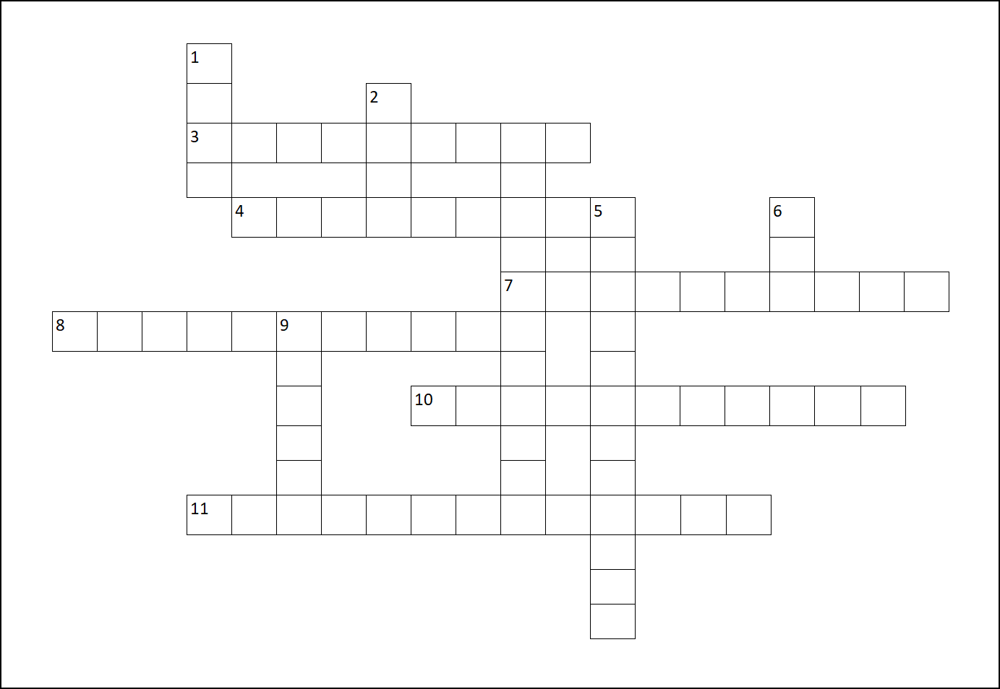

# Devtoberfest 2022 Week - Cryptic Crossword
<!-- description -->Cryptic puzzles are all the rage today, so we decided to put one together related to Devtoberfest and SAP.

## You will learn
- A lot of technology during Devtoberfest 

## Intro

This tutorial is part of the Devtoberfest 2022, a celebration of and for Developers. For more information, see the [Devtoberfest Group](https://groups.community.sap.com/t5/devtoberfest/gh-p/Devtoberfest).

If you are not familiar with cryptic crosswords, you can learn about how cryptics work> here's [one site](http://www.sarahlolley.com/intro-to-cryptic-crosswords.html), but there are many others. 

All the cryptic answers in our puzzle can be put into this crossword grid.

### Question 1

### Question 2

### Question 3

### Question 4

### Question 5

### Question 6

### Question 7

### Question 8

### Question 9

### Question 10

### Question 11
