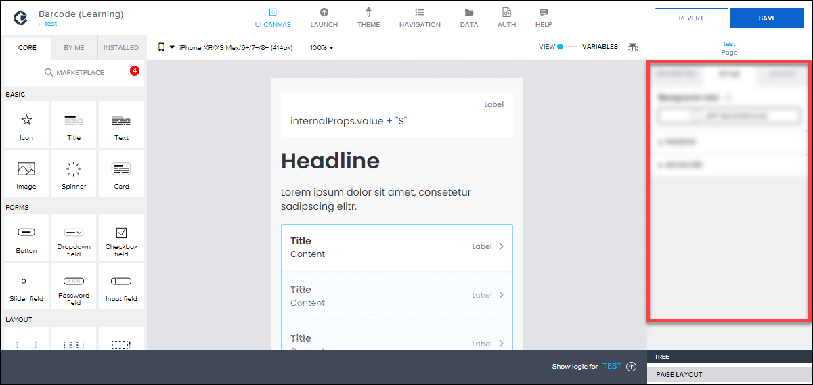
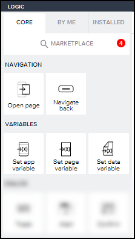
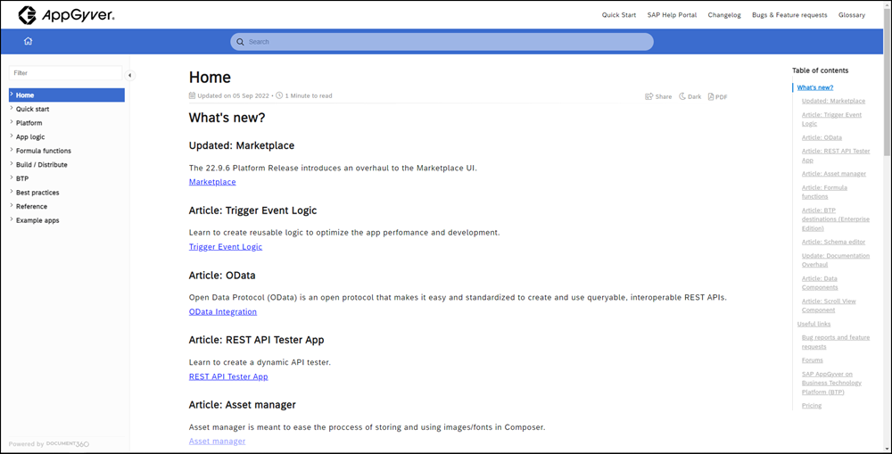

# 🔴 Devtoberfest - SAP AppGyver Challenge - Easy
<!-- description --> In the second week of Devtoberfest, the low-code, no-code track is focused on SAP AppGyver. Here's an easy quiz so you earn extra points toward the Devtoberfest grand prize.

## Intro

This tutorial is part of the Devtoberfest 2022, a celebration of and for Developers. For more information, see the [Devtoberfest Group](https://groups.community.sap.com/t5/devtoberfest/gh-p/Devtoberfest).

---

### Question 1

### Question 2
To build your logic, SAP AppGyver comes with a bunch of flow functions.

### Question 3

For this question, it might help to visit the documentation: [Formula Functions](https://docs.appgyver.com/docs/formula-functions)

