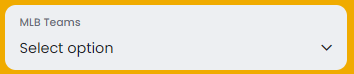
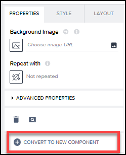

# 🔴 Devtoberfest - SAP AppGyver Challenge - Tough
<!-- description --> In the second week of Devtoberfest, the low-code, no-code track is focused on SAP AppGyver. Here's a little tougher quiz so you earn extra points toward the Devtoberfest grand prize.

## You will learn
- A lot of technology during Devtoberfest

## Intro


This tutorial is part of the Devtoberfest 2022, a celebration of and for Developers. For more information, see the [Devtoberfest Group](https://groups.community.sap.com/t5/devtoberfest/gh-p/Devtoberfest).

---

### Question 1

### Question 2
Let's say I have a dropdown list control. I also have retrieved data as a collection in a data variable called `mlbTeams1`, where each record has a field called `name_display_full` and `team_id`.

Now, I want to bind this data to the **Option list** field of the dropdown control, so that the dropdown list displays the team's name, but the value for the selected item is the team ID.

For this we use the standard **Dropdown field** (Core). Here's some information if you want to read about it: <https://forums.appgyver.com/t/populate-dropdown-field/757/2>



>**NOTE:** Do not use the LOOKUP function, and remove all spaces from your formula before entering it below.


### Question 3
You have an API that returns the following JSON (in part):

```JSON
{
    "team_all_season": {
        "copyRight": " NOTICE: This file is no longer actively supported. Please use the MLB Stats API (http://statsapi.mlb.com/docs/) as an alternative. Copyright 2022 MLB Advanced Media, L.P.  Use of any content on this page acknowledges agreement to the terms posted here http://gdx.mlb.com/components/copyright.txt  ",
        "queryResults": {
            "totalSize": "30",
            "created": "2022-09-23T08:17:50",
            "row": [{
                    "team_id": "109",
                    "name_display_long": "Arizona Diamondbacks"
                }, {
                    "team_id": "144",
                    "name_display_long": "Atlanta Braves"
                }, {
                    "team_id": "110",
                    "name_display_long": "Baltimore Orioles"
                }, {
                    "team_id": "111",
                    "name_display_long": "Boston Red Sox"
                }, {
                    "team_id": "112",
                    "name_display_long": "Chicago Cubs"
                }, {
                    "team_id": "145",
                    "name_display_long": "Chicago White Sox"
                }, {
                    "team_id": "113",
                    "name_display_long": "Cincinnati Reds"
                }, {
                    "team_id": "114",
                    "name_display_long": "Cleveland Guardians"
                }, {
                    "team_id": "115",
                    "name_display_long": "Colorado Rockies"
                }, {
                    "team_id": "116",
                    "name_display_long": "Detroit Tigers"
                }, {
                    "team_id": "117",
                    "name_display_long": "Houston Astros"
                }, {
                    "team_id": "118",
                    "name_display_long": "Kansas City Royals"
                }, {
                    "team_id": "108",
                    "name_display_long": "Los Angeles Angels"
                }, {
                    "team_id": "119",
                    "name_display_long": "Los Angeles Dodgers"
                }, {
                    "team_id": "146",
                    "name_display_long": "Miami Marlins"
                }, {
                    "team_id": "158",
                    "name_display_long": "Milwaukee Brewers"
                }, {
                    "team_id": "142",
                    "name_display_long": "Minnesota Twins"
                }, {
                    "team_id": "121",
                    "name_display_long": "New York Mets"
                }, {
                    "team_id": "147",
                    "name_display_long": "New York Yankees"
                }, {
                    "team_id": "133",
                    "name_display_long": "Oakland Athletics"
                }, {
                    "team_id": "143",
                    "name_display_long": "Philadelphia Phillies"
                }, {
                    "team_id": "134",
                    "name_display_long": "Pittsburgh Pirates"
                }, {
                    "team_id": "135",
                    "name_display_long": "San Diego Padres"
                }, {
                    "team_id": "137",
                    "name_display_long": "San Francisco Giants"
                }, {
                    "team_id": "136",
                    "name_display_long": "Seattle Mariners"
                }, {
                    "team_id": "138",
                    "name_display_long": "St. Louis Cardinals"
                }, {
                    "team_id": "139",
                    "name_display_long": "Tampa Bay Rays"
                }, {
                    "team_id": "140",
                    "name_display_long": "Texas Rangers"
                }, {
                    "team_id": "141",
                    "name_display_long": "Toronto Blue Jays"
                }, {
                    "team_id": "120",
                    "name_display_long": "Washington Nationals"
                }
            ]
        }
    }
}
```


### Question 4
Composite components are described here: [Creating and editing view components](https://docs.appgyver.com/docs/creating-and-editing-view-components)



