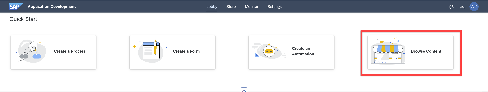
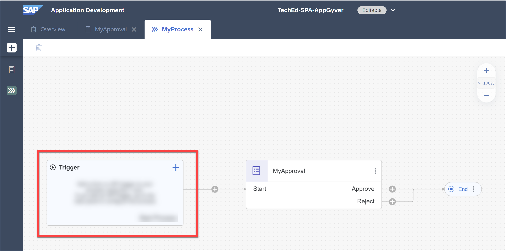
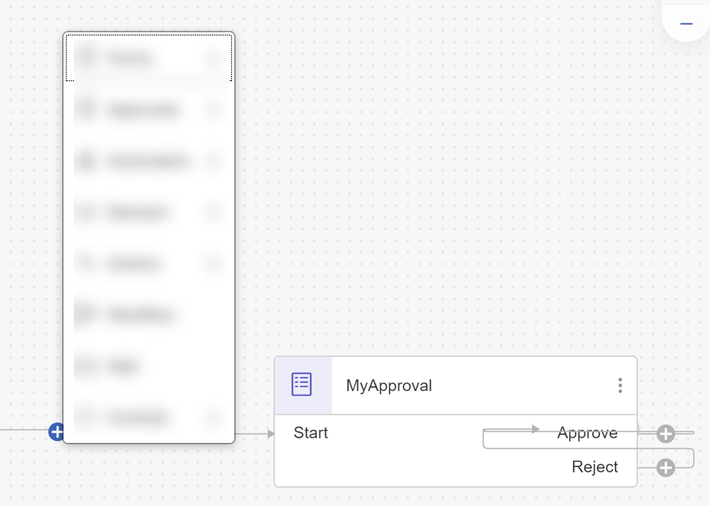

# 🔴 Devtoberfest - SAP Process Automation - Easy
<!-- description --> In the third week of Devtoberfest, the low-code, no-code track is focused on SAP Process Automation. Here's an easy quiz so you earn extra points toward the Devtoberfest grand prize.

## You will learn
- A lot of technology during Devtoberfest

## Intro

This tutorial is part of the Devtoberfest 2022, a celebration of and for Developers. For more information, see the [Devtoberfest Group](https://groups.community.sap.com/t5/devtoberfest/gh-p/Devtoberfest).

### Question 1

### Question 2

### Question 3

### Question 4

