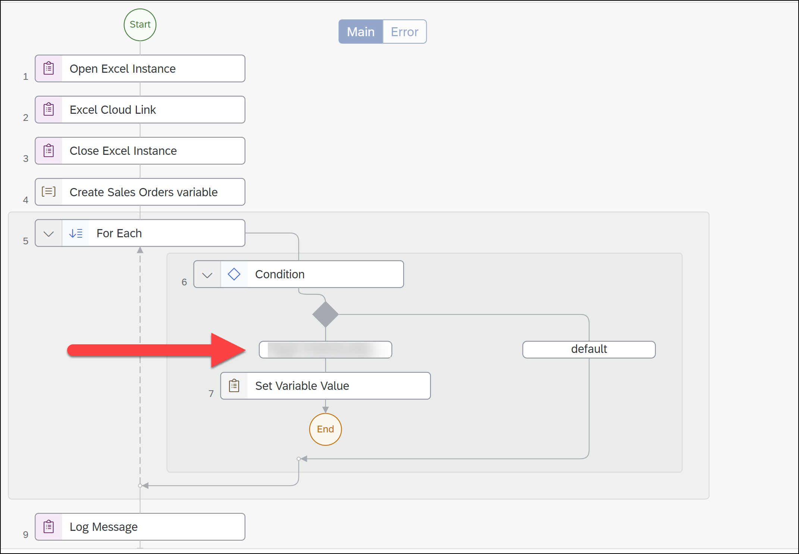

# 🔴 Devtoberfest - SAP Process Automation Challenge - Tough
<!-- description --> In the third week of Devtoberfest, the low-code, no-code track is focused on SAP Process Automation. Here's a little tougher quiz so you earn extra points toward the Devtoberfest grand prize.

## You will learn
- A lot of technology during Devtoberfest

## Intro

This tutorial is part of the Devtoberfest 2022, a celebration of and for Developers. For more information, see the [Devtoberfest Group](https://groups.community.sap.com/t5/devtoberfest/gh-p/Devtoberfest).

---

### Question 1

### Question 2

### Question 3

### Question 4

### Question 5

If I create an automation with the following:

- A data type called `Sales Order` with the following fields:
    - `orderNumber`
    - `orderAmount`
    - `orderDate`
    - `orderStatus`
- Input parameter for the automation called `OrderNumber`.
- Step 2 reads an Excel sheet and stores the records as type `Sales Order` in a variable called `orders`. 

Now, I have a **For Each** loop in Step 5 that iterates over the `orders` variable from Step 2, and then I build a condition inside the loop to check if the current item in the list has an order number that matches the automations input parameter (`OrderNumber`).

Each item in the loop is stored in `currentMember` (which would be of type `Sales Order`) and the index is stored in `index`.

Write a formula to test whether the current item's order number matches the input parameter.

>For help, see the tutorial [Create an Automation to Extract Data](https://developers.sap.com/tutorials/spa-create-automation.html).

