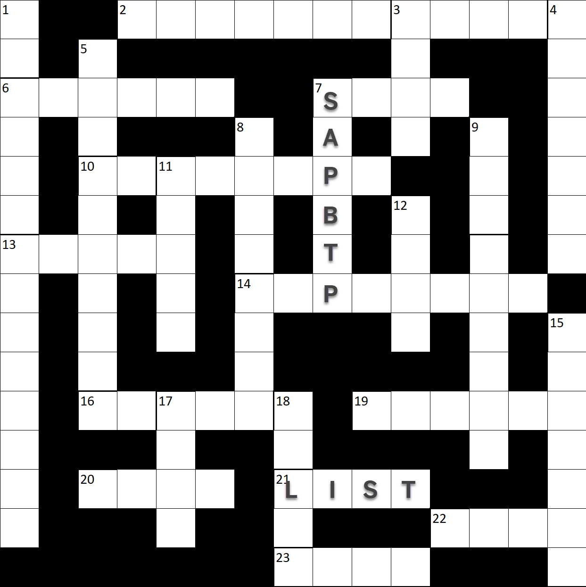

# 🟣 Devtoberfest 2023 - SAP Build Cryptic Crossword
<!-- description --> We hope you enjoy Cryptic Crosswords and SAP Build as much as we do. Solve all the answers in the puzzle and earn mega points for the Devtoberfest grand prize.
 
## You will learn
- A lot about technology – and yourself – during Devtoberfest

## Intro
This tutorial is part of the Devtoberfest 2023, a celebration of and for Developers. For more information, see the [Devtoberfest Group](https://groups.community.sap.com/t5/devtoberfest/gh-p/Devtoberfest).

&nbsp;

For specifics on the Devtoberfest contest and the grand prize, see this [Devtoberfest 2023 Contest blog](https://groups.community.sap.com/t5/devtoberfest-blog-posts/devtoberfest-2023-contest/ba-p/9357)

The way this works is you have to fill out this grid, but each clue is described in a separate step and you must enter the answer there. You can copy the grid and fill in the answers as you enter them in the steps of this tutorial.

&nbsp;

If you are not familiar with cryptic crosswords, there are many sites that explain the brilliance that are cryptic crossword puzzles. Here's one: [Cryptic Crossword](http://www.sarahlolley.com/intro-to-cryptic-crosswords.html).

But in short, instead of each clue being just a definition, each clue has 2 parts (one at the start and one at the end). One part – which can be at the start or the end – is a definition, but the other part is clue to how to form the word. All clues indicate the number of letters in the answer.

For example, my favorite clue is something like this:

>Pa’s mixed up about cloud software company (3)

1. The first part describes the answer's letters. "mixed up" suggests an anagram of "Pa's".

2. The second part is the definition "cloud software company".

So the answer is, of course,  ... SAP 🥳 

We have already filled in 2 answers for you: **SAP BTP** (the platform on which SAP Build is available) and **List** (a complex data type in SAP Build Apps and SAP Build Process Automation).

### 2 Across

### 6 Across

### 7 Across

### 10 Across

### 13 Across

### 14 Across

### 16 Across

### 19 Across

### 20 Across

### 22 Across

### 23 Across

### 1 Down

### 3 Down

### 4 Down

### 5 Down

### 8 Down

### 9 Down

### 11 Down

### 12 Down

### 15 Down

### 17 Down

### 18 Down

