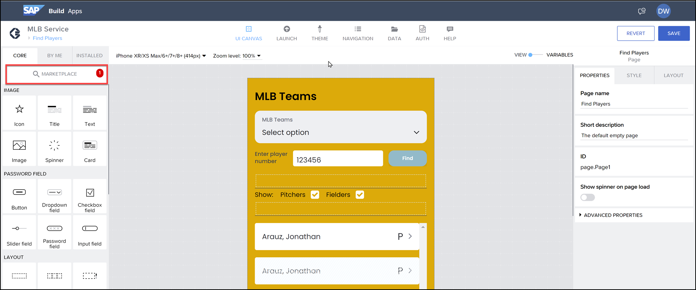
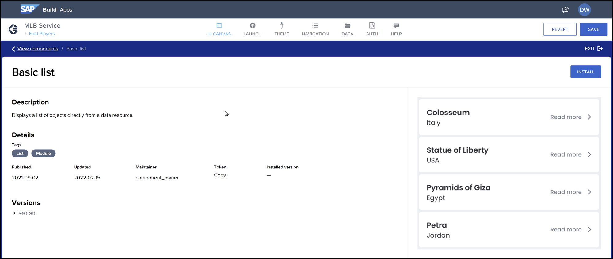
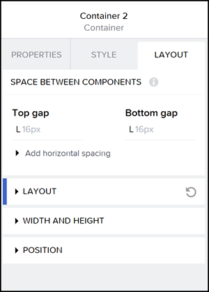
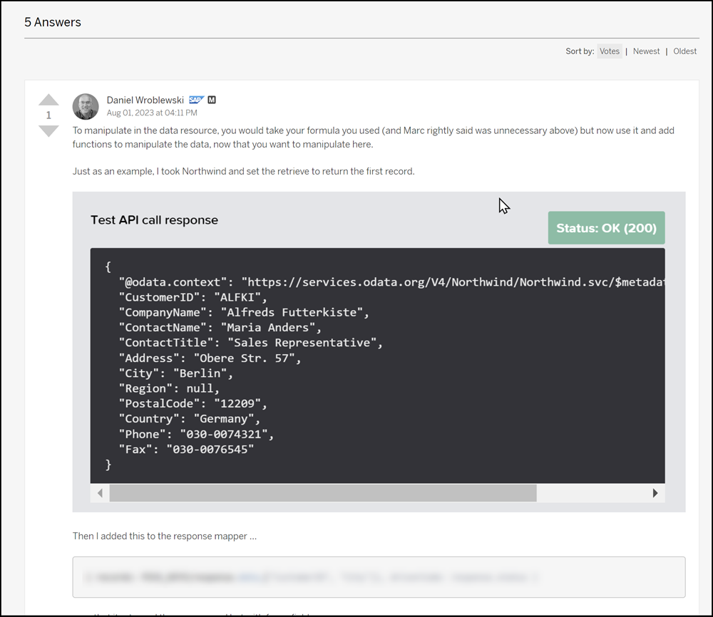
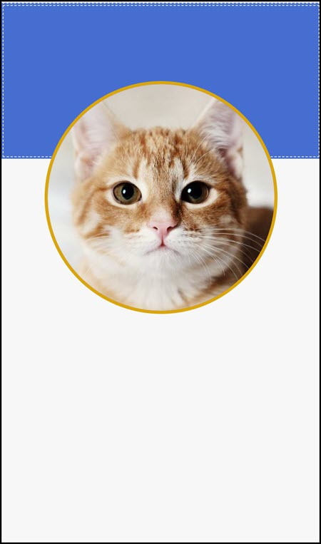

# 🟣 Devtoberfest 2023 - SAP Build Apps Quiz
<!-- description --> So you think you know SAP Build Apps? Take this quiz and earn points for the Devtoberfest grand prize.
 
## You will learn
- A lot about technology – and yourself – during Devtoberfest

## Intro
This tutorial is part of the Devtoberfest 2023, a celebration of and for Developers. For more information, see the [Devtoberfest Group](https://groups.community.sap.com/t5/devtoberfest/gh-p/Devtoberfest).

&nbsp;

For specifics on the Devtoberfest contest and the grand prize, see this [Devtoberfest 2023 Contest blog](https://groups.community.sap.com/t5/devtoberfest-blog-posts/devtoberfest-2023-contest/ba-p/9357)

### Question 1
In addition to the basic UI components available in the **Core** tab, you can find additional components in the Marketplace.

Each component has an ID, also known as a token, which lets you search for it in the Marketplace. For the components provided by SAP, they will be displayed in the Marketplace and you can see them and search by their names. But you can still get their token in the component's description page.

But components that you create and publish to the Marketplace, they will not appear in the Marketplace listing and you will have to provide the token to whomever you want to share it with.

### Question 2

For a Container component, you can go to the **Layout** tab and set the height and width. 

### Question 3
Read Daniel Wroblewski's answer to the question [Mapping a rest API response in Build Apps](https://answers.sap.com/questions/13941448/mapping-a-rest-api-response-in-build-apps.html). Daniel explains that you can manipulate the data that comes back from an OData call by specifying a response mapper.

### Question 4
Read Daniel Wroblewski's blog [Handling Images in SAP Build Apps](https://blogs.sap.com/2023/06/18/handling-images-in-sap-build-apps/). 

In the section on how to take a photo with your mobile phone's camera and display in your app ( **Image from Phone** ), you must get a value from the output of the **Take photo** flow function and pass it to the **Image** component -- so the component can display the image now located in the file system of the phone. 

### Question 5
We created a start of an app by creating a cute UI. If you want, you can install the app by downloading it [CatApp.zip.gpg](https://github.com/sap-tutorials/devtoberfest-2022/raw/main/tutorials/devtoberfest2023-scavenger-quiz-apps/CatApp.zip.gpg).

We created only 3 things:

- Container to create the blue field
- Container to hold the cat
- Image component inside the second container

To learn more of how to set up UIs like these, see the [Curiosity Labs YouTube channel](https://www.youtube.com/@CuriosityLab_talk).

The next 3 questions relate to this layout. 

### Question 6

### Question 7