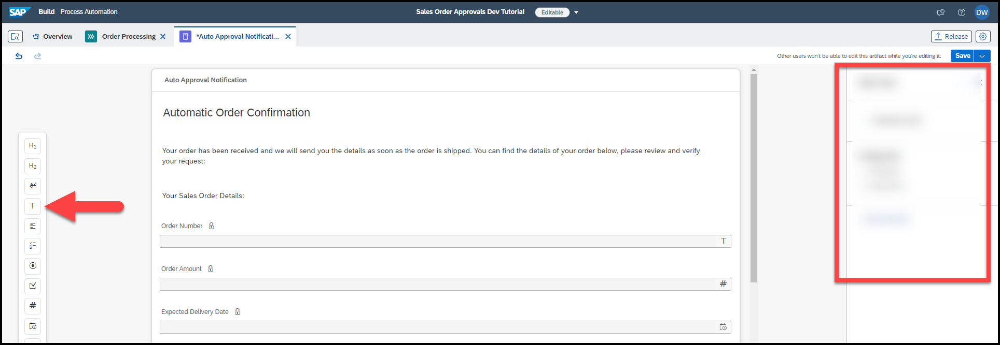
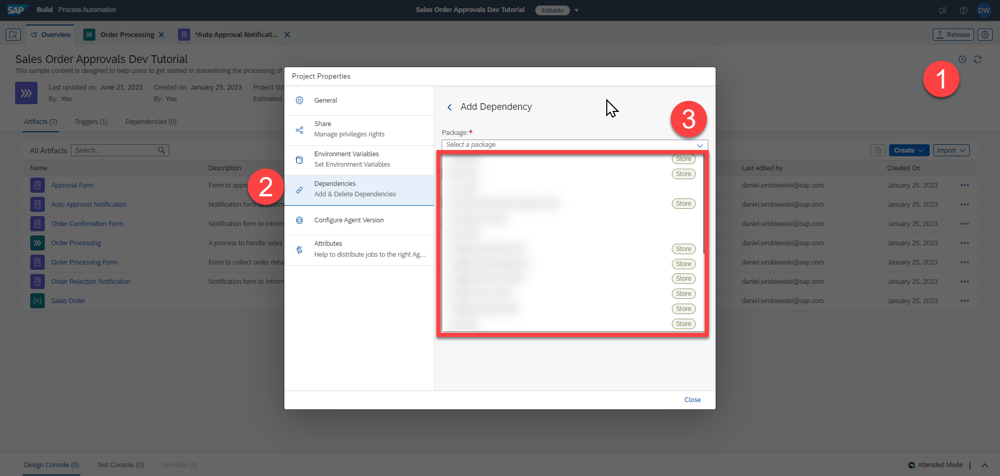

# 🟣 Devtoberfest 2023 - SAP Build Process Automation Quiz
<!-- description --> So you think you know SAP Build Process Automation? Take this quiz and earn points for the Devtoberfest grand prize.
 
## You will learn
- A lot about technology – and yourself – during Devtoberfest

## Intro
This tutorial is part of the Devtoberfest 2023, a celebration of and for Developers. For more information, see the [Devtoberfest Group](https://groups.community.sap.com/t5/devtoberfest/gh-p/Devtoberfest).

&nbsp;

For specifics on the Devtoberfest contest and the grand prize, see this [Devtoberfest 2023 Contest blog](https://groups.community.sap.com/t5/devtoberfest-blog-posts/devtoberfest-2023-contest/ba-p/9357)

&nbsp;

### Question 1
A key component within a process is the form, whether to start a process, to get approval from a user, or to just notify someone.

The form editor lets you drag components onto the form and to configure them.

### Question 2
In the documentation, you learn more about [triggers for processes](https://help.sap.com/docs/build-process-automation/sap-build-process-automation/create-business-process?locale=en-US&q=trigger) and [triggers for automations](https://help.sap.com/docs/build-process-automation/sap-build-process-automation/add-automation-trigger-to-project?locale=en-US&q=trigger).

### Question 3
SDKs are the connectors that enable your automation bot to connect to different technologies like SAP GUI or SAPUI5.

You can learn more about SDKs in the [documentation](https://help.sap.com/docs/intelligent-robotic-process-automation/cloud-studio-user-guide/automation-activities-provided-by-sdk-packages). You can also open a project and see the potential dependencies you can add to your project.

### Question 4
You can send mails within your automation by creating a destination with all the details about your mail server.

You can learn more about setting this up in the [documentation](https://help.sap.com/docs/build-process-automation/sap-build-process-automation/configuring-smtp-mail-destination).

