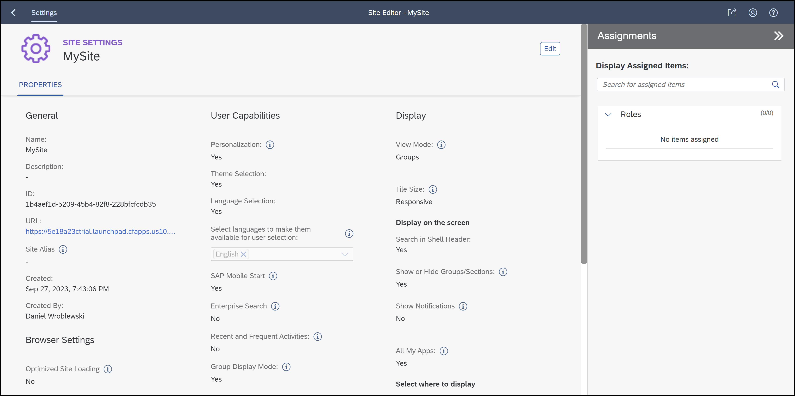

# 🟣 Devtoberfest 2023 - SAP Build Work Zone Quiz
<!-- description --> So you think you know SAP Build Work Zone? Take this quiz and earn points for the Devtoberfest grand prize.
 
## You will learn
- A lot about technology – and yourself – during Devtoberfest

## Intro
This tutorial is part of the Devtoberfest 2023, a celebration of and for Developers. For more information, see the [Devtoberfest Group](https://groups.community.sap.com/t5/devtoberfest/gh-p/Devtoberfest). 

&nbsp;

For specifics on the Devtoberfest contest and the grand prize, see this [Devtoberfest 2023 Contest blog](https://groups.community.sap.com/t5/devtoberfest-blog-posts/devtoberfest-2023-contest/ba-p/9357)

For these questions, you can install the SAP Build Work Zone, standard edition on your SAP BTP trial account. See [Set Up SAP Build Work Zone, standard edition Using a Trial Account](https://developers.sap.com/tutorials/cp-portal-cloud-foundry-getting-started.html) for instructions on installing (<10 minutes).

For full tutorial, see [Deliver Your First Business Site Using SAP Build Work Zone, Standard Edition](https://developers.sap.com/mission.launchpad-cf.html)

For a full documentation, see [SAP Build Work Zone, standard edition](https://help.sap.com/docs/build-work-zone-standard-edition).

### Question 1
Here is the Content Manager tab of SAP Build Work Zone, standard edition.

On the left you see the 4 tabs: 

- Site Directory

- Content Manager

- Channel Manager

- Settings

### Question 2
If you create a site, and then go into the **Site Settings** (automatically opened after creating a site), there is a setting for **Display**.

### Question 3
If you go to content channels, you will see the channels that can provide content to your sites. Click **New** you can add a Content Package or a Content Provider.

Now, open the documentation [Content Providers - Cloud Solutions](https://help.sap.com/docs/build-work-zone-standard-edition/sap-build-work-zone-standard-edition/content-providers-cloud-solutions) to learn about the possible providers.

### Question 4