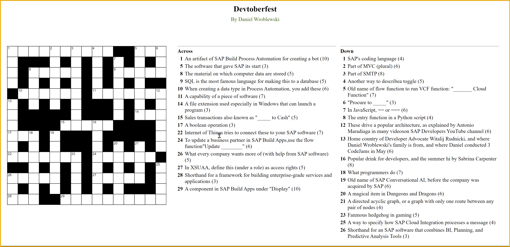

  
# 🟣 Devtoberfest 2024 - SAP Crossword
<!-- description --> As has become tradition, we offer you a crossword with many SAP terms, many of them from SAP Build, and a few related to the current pop music scene. You will win lots of points if you can complete the whole thing.
 
## You will learn
- A lot about technology – and yourself – during Devtoberfest

## Prerequisites
- None 😺

## Intro

&nbsp;

We recommend printing out the grid and completing the puzzle, and then entering the individual answers in the step answers below.

>**TIP:** If you need any help, please post in the discussion [Friends helping friends solve the SAP Crossword Puzzle](https://community.sap.com/t5/devtoberfest-discussions/friends-helping-friends-solve-the-sap-crossword-puzzle/m-p/13876916/highlight/true#M1240).

This puzzle is part of the Devtoberfest 2024, a celebration of and for Developers. For more information and to join the fun, see the [Devtoberfest Group](https://groups.community.sap.com/t5/devtoberfest/gh-p/Devtoberfest) and join the group.

 

&nbsp;

For specifics on the Devtoberfest contest and the grand prize, see this [Devtoberfest 2024 Contest blog](https://community.sap.com/t5/devtoberfest-blog-posts/devtoberfest-2024-contest/ba-p/13781593)

### 1 Across

### 5 Across

### 8 Across

### 9 Across

### 10 Across

### 11 Across

### 14 Across

### 15 Across

### 17 Across

### 22 Across

### 24 Across

### 26 Across

### 27 Across

### 28 Across

### 29 Across

### 1 Down

### 2 Down

### 3 Down

### 4 Down

### 5 Down

### 6 Down

### 7 Down

### 8 Down

### 12 Down

### 13 Down

### 16 Down

### 18 Down

### 19 Down

### 20 Down

### 21 Down

### 23 Down

### 25 Down

### 26 Down

