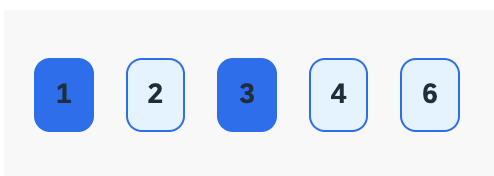

  
# 🟣 Devtoberfest 2024 - Formula Editor Challenge
<!-- description --> For all the 5 questions below, you will find a built-in function that works in the SAP Build Apps formula editor. 
 
## You will learn
- A lot about technology – and yourself – during Devtoberfest

## Prerequisites
- None

## Intro

This challenge is part of the Devtoberfest 2024, a celebration of and for Developers. For more information and to join the fun, see the [Devtoberfest Group](https://groups.community.sap.com/t5/devtoberfest/gh-p/Devtoberfest) and join the group.

 

&nbsp;

For specifics on the Devtoberfest contest and the grand prize, see this [Devtoberfest 2024 Contest blog](https://community.sap.com/t5/devtoberfest-blog-posts/devtoberfest-2024-contest/ba-p/13781593)

### Question 1

Find the missing function that can convert "ICETEA" to 1C3734.

UPPERCASE(________("ICETEA"))

### Question 2

Consider an app variable called **sentence** that contains many words in it, separated by a space. Write the missing function in the formula below in order to display the output as a string with the words in reverse order and separated by a comma without spaces. 

JOIN(________(SPLIT(appVars.sentence, " ")), ",")

For example, if the sentence is "a very long sentence", the output should be "sentence,long,very,a".

### Question 3

Enter the function to complete the formula so that it fills the button background color with **#0070f2** if the number on the button is **Odd** and fills the button background color with **#E1F4FF** if the number is **even**.  

IF(________(repeated.current.id), "#0070f2", "#E1F4FF")

The formula should be generic enough to display the background color accordingly, irrespective of the position of the odd number. For example, in the following image, only the numbers 1 and 3 have the background color as **#0070f2** since they are the only odd numbers.

### Question 4

Complete the formula to print **today's date** in the format, for example, **30/09/24** format.

______("DD/MM/YY")  

### Question 5

Find the missing function in the formula below to convert ("foo", 8, "ABC") to "ABCABfoo".

__________("foo", 8, "ABC")