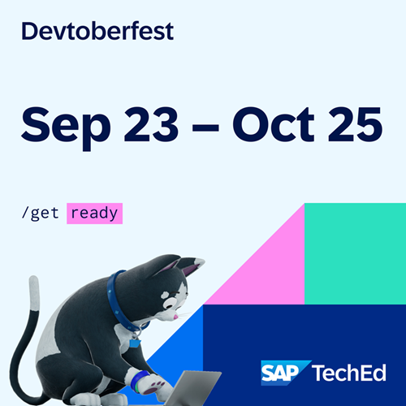

# 🔴 Devtoberfest 2024 - Integration, Week 4, Oct. 23
<!-- description --> We hope you enjoyed the sessions for Integration Wednesday during Week 2 of Devtoberfest. Show that you were listening, and earn extra points toward the Devtoberfest grand prize.  
 
## You will learn
- A lot about technology – and yourself – during Devtoberfest

## Prerequisites
- Attend live or watch a recording of the [Devtoberfest sessions](https://community.sap.com/t5/devtoberfest/eb-p/devtoberfest-events) in Week 4 for Integration Wednesday. Each question will include a link to the relevant session. 

## Intro
This tutorial is part of the Devtoberfest 2024, a celebration of and for Developers. For more information and to join the fun, see the [Devtoberfest Group](https://groups.community.sap.com/t5/devtoberfest/gh-p/Devtoberfest) and join the group.

 

&nbsp;

For specifics on the Devtoberfest contest and the grand prize, see this [Devtoberfest 2024 Contest blog](https://community.sap.com/t5/devtoberfest-blog-posts/devtoberfest-2024-contest/ba-p/13781593)

  
 <!--

### Question 1 
Attend live or watch a recording of [🔴 Improve Operational Efficiency using AI-enabled API Anomaly Detection](https://youtube.com/watch?v=KvEWoKtGB9c).

<iframe width="560" height="315" src="https://www.youtube.com/embed/KvEWoKtGB9c" frameborder="0" allowfullscreen></iframe>

 
### Question 2 
Attend live or watch a recording of [🔴 Enterprise Automation with SAP: Latest Enhancements](https://youtube.com/watch?v=m46jocrGUas).

<iframe width="560" height="315" src="https://www.youtube.com/embed/m46jocrGUas" frameborder="0" allowfullscreen></iframe>

-->